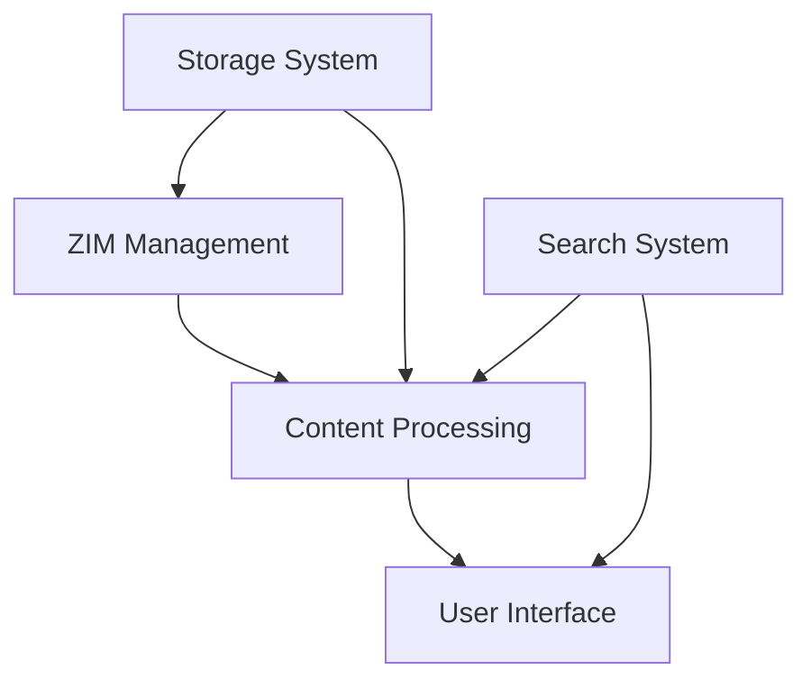

# Robinpedia Architecture Overview

## Current Focus (February-March 2025)

Our immediate focus is building a robust, standalone ZIM reader with these core capabilities:
1. Efficient ZIM file handling
2. Clean article presentation
3. Basic navigation and search
4. Reliable offline access

### System Components

## Core Systems

### 1. ZIM Reader System
[Full details in docs/architecture/ZIM_READER_SYSTEM.md]
- ZIM format parsing
- Content extraction
- Image handling
- Article navigation

### 2. Download System
[Full details in docs/architecture/DOWNLOAD_SYSTEM.md]
- ZIM file downloading
- Resume capability
- Progress tracking
- Storage management

### 3. Search System (Phase 1)
- Basic full-text search
- Title indexing
- Recent articles
- Simple bookmarks

## Development Phases

### Phase 1: Core Reader (Current)
Goal: Functional ZIM reader with basic features
Timeline: 2-3 weeks

1. Week 1: ZIM Infrastructure
   - Complete ZIM parser
   - Implement cluster handling
   - Set up content extraction

2. Week 2: Content & UI
   - Article rendering
   - Image display
   - Basic navigation
   - Simple search

3. Week 3: Polish & Stability
   - Performance optimization
   - Error handling
   - Basic offline support
   - Initial testing

### Phase 2: Enhanced Features
Timeline: After Phase 1 completion

1. Annotations
   - Text highlighting
   - Simple notes
   - Bookmarks
   - Local storage

2. Search Improvements
   - Advanced search options
   - Category browsing
   - Search history
   - Related articles

### Future Phases (Prioritized)

1. Knowledge Graph (Deferred)
   - Article relationships
   - Topic mapping
   - Learning paths
   - Content discovery

2. Social Features (Deferred)
   - Sharing
   - Collaborative notes
   - Study groups
   - Progress tracking

## Architecture Principles

1. Offline First
   - All core functionality works offline
   - Efficient storage use
   - Robust state management
   - Clear sync boundaries

2. Performance Focus
   - Fast article loading
   - Efficient memory use
   - Smooth navigation
   - Responsive search

3. Modular Design
   - Clear component boundaries
   - Well-defined interfaces
   - Testable units
   - Easy maintenance

4. User-Centric
   - Simple navigation
   - Clear feedback
   - Reliable operation
   - Intuitive interface

## Technical Stack

1. Core Technologies
   - Flutter/Dart
   - SQLite
   - LZMA decompression
   - Custom ZIM handler

2. Storage Layer
   - File system for ZIM files
   - SQLite for search index
   - Secure storage for settings
   - Cache management

3. UI Components
   - Material Design
   - Custom article renderer
   - Native platform integration
   - Responsive layouts

## Testing Strategy

1. Unit Tests
   - Core parsers
   - Data handlers
   - Business logic
   - Utility functions

2. Integration Tests
   - Component interaction
   - Data flow
   - State management
   - Error handling

3. Performance Tests
   - Memory usage
   - Load times
   - Search speed
   - Storage efficiency

## Success Metrics

1. Performance
   - Article load < 500ms
   - Search results < 200ms
   - Memory usage < 100MB
   - Smooth scrolling

2. Reliability
   - Crash-free sessions > 99.9%
   - Successful article loads > 99.9%
   - Valid search results > 99.9%
   - Data integrity 100%

3. User Experience
   - Clear navigation
   - Responsive interface
   - Intuitive controls
   - Helpful feedback

## Next Steps

1. Complete ZIM parser implementation
2. Build cluster management system
3. Update article rendering
4. Implement basic search
5. Add navigation system

## Note on Knowledge Graph

The knowledge graph feature has been deferred to a future phase. Current focus is on building a solid, functional ZIM reader. This ensures:
- Core functionality is robust
- User experience is polished
- Performance is optimized
- Foundation is solid for future features