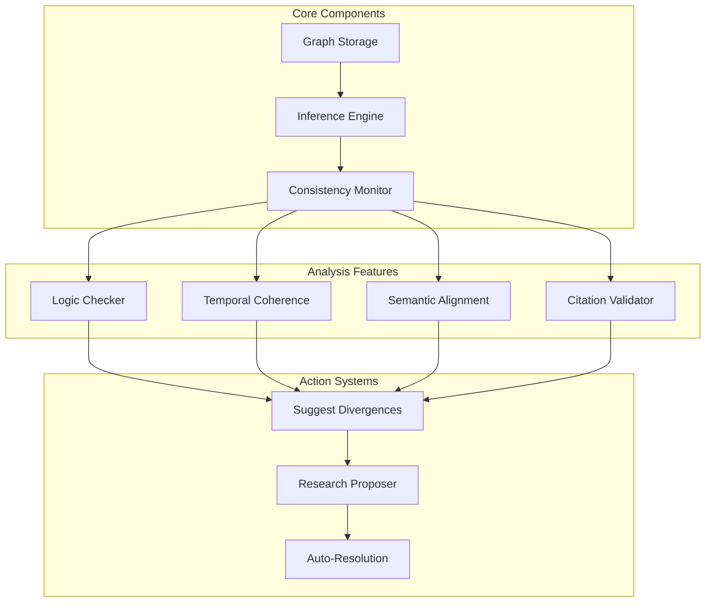

# Future Features (Post v1.0)

## Knowledge Graph Integration & Analysis

### Graph Transition
- Custom graph storage engine for Android
- Tiered functionality based on device capabilities
- Offline-first architecture
- Memory-efficient implementation

### Conceptual Alignment Engine

### Resource Requirements
- RAM: 4GB+ recommended
- Storage: 10GB+ for models
- CPU: Modern quad-core
- GPU: Optional but beneficial

### Implementation Timeline
1. **Phase 1** (Core): 2-3 months
   - Graph storage engine
   - Basic inference system
   - Consistency monitoring

2. **Phase 2** (Analysis): 3-4 months
   - Logic checking
   - Temporal coherence
   - Semantic analysis
   - Citation validation

3. **Phase 3** (Actions): 2-3 months
   - Divergence detection
   - Research suggestions
   - Auto-resolution system

### Expected Benefits
- Contradiction detection
- Knowledge gap identification
- Citation chain validation
- Temporal consistency checking
- Semantic alignment suggestions

## Mesh Network Integration
- LoRa support for offline sharing
- P2P knowledge synchronization
- Distributed verification

## Advanced UI Features
- AR annotations
- 3D knowledge visualization
- Voice interface
- Gesture controls

## Future Features (v2)

## Knowledge Visualization 🎨
- Force-directed graph visualization
  - Interactive spring physics
  - Zoom and pan navigation
  - Topic clusters
  - Connection strength indicators
  - Subtle Engagement
    - Almost imperceptible node breathing
    - Gentle peripheral movement
    - Subliminal attraction cues
    - Natural eye-path guidance
    - No obvious "click me!" stuff
  - Click/tap to explore nodes
  - Visual history trails
  - "You are here" indicators
  - Save interesting graph views
  - Auto-explore mode
    - Organic timing system
      - No obvious patterns
      - Natural attention rhythms
      - Context-aware pacing
      - Environmental adaptation
      - Seamless transitions
    - Smooth camera transitions between nodes
    - Automatic zoom to interesting clusters
    - Subtle discovery hints
    - Visual breadcrumbs (fade naturally)
    - Ambient audio (barely noticeable)
    - Optional whispered insights

## Enhanced Engagement
- 3D knowledge space navigation
- AR view for physical books
- Collaborative exploration rooms
- Voice-guided wiki walks
- Ambient knowledge radio
- "Did You Know" System
  - Natural Discovery
    - No popup bombardment
    - Content emerges organically
    - Feels like your own discovery
    - Ambient awareness
    - "Wait, what was that?"
  - Content selection
    - Psychology-aware timing
    - Attention-respectful
    - Natural topic flow
    - Subtle intrigue building
    - "Hmm, interesting..." moments

## Premium Features
### Hardware Enhancements
- RobinMesh Module (ESP32-based)
  - Automatic peer discovery
  - Local content sharing
  - Mesh network topology
  - Battery-powered operation
  - Solar charging capability
  - Range extender mode
  - Encrypted communication
  - Automatic content sync
  - Priority content routing

### Content Subscriptions
- Modular Knowledge Domains
  - Topic-specific ZIM bundles
  - Custom content curation
  - Automatic updates while available
  - Priority download queue
  - Delta updates for bandwidth saving
  - Cross-reference optimization
  - Content verification system

### Mesh Network Features
- Local Knowledge Sharing
  - Peer content discovery
  - Bandwidth optimization
  - Network health monitoring
  - Automatic failover
  - Content availability mapping
  - Mesh network visualization
  - Node status monitoring
  - Network topology optimization

### Advanced Features
- Custom ZIM Creation
  - Personal content bundling
  - Topic-specific archives
  - Content verification
  - Metadata enhancement
  - Cross-reference generation
  - Search optimization
  - Media optimization
  - Compression options

- Custom knowledge graphs
- Advanced visualization tools
- Personal knowledge export
- Team collaboration tools
- "Peace of Mind" Package
  - Automated knowledge domain downloads
  - Smart bandwidth usage detection
  - "Last chance to download!" notifications
  - Dynamic pricing based on global events
    - News sentiment analysis
    - Infrastructure status monitoring
    - "You really should get this NOW" alerts
  - Bulk download optimization
    - Priority queue jumping
    - Multi-connection downloads
    - "Before it's too late" scheduling
  
- "Just in Case" Tier
  - Offline-first everything
  - Auto-sync across devices
    - While you still can!
  - Automated redundancy
  - Local-first mesh networking
    - Because who needs the internet?
  
- "I Told You So" Elite Status
  - Priority support
    - While support exists 😉
  - Advanced knowledge graphs
  - Custom domain bundling
  - Automatic payment processing
    - Multiple cryptocurrency options
    - "It still works!" guarantee
    - Automated renewal
      - Even after... you know... 

### Dynamic Pricing Strategies 🏷️

#### Time-Based Urgency
- "Last Chance" Knowledge Bundles
  - "Only 3 copies left at this price!"
  - "This survival guide will be archived soon!"
  - "Limited time offer on complete medical knowledge!"
  - "Download now before bandwidth gets worse!"

#### FOMO-Driven Packages
- "Everyone in your area is learning this!"
- "73 preppers near you downloaded this bundle"
- "Trending: Urban Farming Techniques"
- "Your neighbors are getting prepared, are you?"

#### Late Night Specials
- 3 AM "Can't Sleep" Deals
  - "Since you're up anyway..."
  - "Special midnight knowledge seeker discount"
  - "Night owl knowledge bundle"
  - "Insomnia-inspired learning pack"

#### Scarcity Marketing
- "Limited bandwidth remaining!"
- "Server space running low!"
- "Download while you still can!"
- "Premium slots almost full!"

#### Social Proof
- "Join 10,000+ prepared individuals"
- "Trusted by survival experts"
- "Top rated in your region"
- "Recommended by fellow knowledge seekers"

> Note: All marketing must maintain plausible deniability about why someone might want this knowledge. Remember: we're just selling peace of mind! 😉

## Infrastructure
- Distributed p2p knowledge sharing
- Local-first sync
- Offline LLM integration
- Custom embedding models

## Mobile Enhancements
- Gesture-based navigation
- Picture-in-picture facts
- Widget support
- Share cards

## Desktop Features
- Multiple window support
- Custom workspace layouts
- External monitor optimization
- Keyboard shortcuts

## Accessibility
- Screen reader optimization
- High contrast modes
- Custom font support
- Voice control
- Gesture control

## Social Features
- Knowledge clubs
- Group exploration
- Shared annotations
- Learning challenges
- Achievement sharing

## Remember
These features are exciting but should only be considered after:
1. Core ZIM reader is stable
2. Basic offline functionality works
3. Essential user features are polished
4. Performance is optimized for low-end devices
