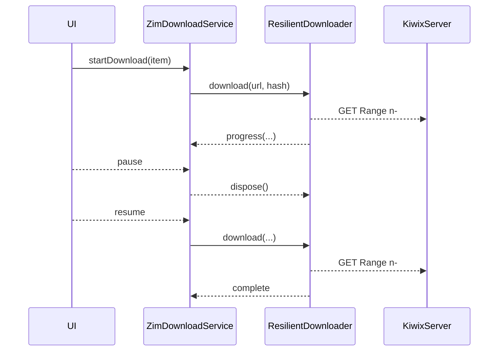
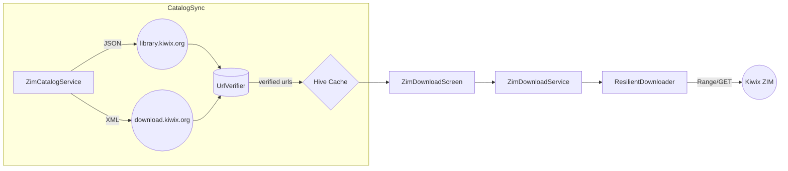

# Robinpedia – Live Kiwix Catalog & Resilient Downloader  
Blueprint Date: **2025-05-08**  
UUID: `9e17429c-2dfe-4f5e-a15c-robinpedia-android-catalog-20250508`

---

## Overview  
This blueprint removes placeholder ZIM catalog data in favour of a real-time Kiwix feed, fixes resume logic in `ResilientDownloader`, and documents the Android dev-build workflow.

---

## Phase Map  

| Phase | Goal | Key Artifacts |
|-------|------|---------------|
| 0 | Governance & hKG Sync | Neo4j / Qdrant / Postgres nodes |
| 1 | Android Dev Build & Push | Debug APK on `192.168.0.18:1031` |
| 2 | Live Kiwix Catalog | `ZimCatalogService` overhaul, JSON + XML parsers, cache |
| 3 | Downloader Alignment | SHA-256 verify, single-completion bug fix |
| 4 | UI Wiring | Live list + error banner |
| 5 | Docs & Final hKG | Updated ARCHITECTURE.md, diagrams |

---

## Key Interfaces

```dart
/// Ensure cache fresh then filter results
Future<List<ZimCatalogItem>> searchCatalog({
  String? query,
  String? lang,
  String? category,
  int count = 20,
  int offset = 0,
});

/// Force refresh from remote
Future<void> refreshRemoteCatalog({bool force = false});

/// Clear Hive cache (debug)
Future<void> clearCache();
```

### Downloader Notes

* Emits `DownloadStatus` once per lifecycle  
* SHA-256 integrity check (`crypto` pkg)  
* Resume logic: append mode, `Range` header, `.resume` temp file  
* Errors throw `DownloadException` / `IntegrityException`

---

## Build & Deploy Commands (Phase 1)

```bash
bash scripts/use_java17.sh
flutter clean
flutter build apk --debug
adb connect 192.168.0.18:1031
adb -s 192.168.0.18:1031 install -r \
  build/app/outputs/flutter-apk/app-debug.apk
adb -s 192.168.0.18:1031 shell monkey \
  -p world.robinsai.robinpedia \
  -c android.intent.category.LAUNCHER 1
```

---

## Sequence – Resume Download



---

## Data Flow



---

## Quality Gates  
1. **Macro** App builds & installs; catalog has no placeholders  
2. **Meso** `searchCatalog` returns >0 verified items  
3. **Micro** No “Future already completed” after pause/resume  

---

_Autogenerated by Roo; synced to hybrid Knowledge Graph under matching UUID._