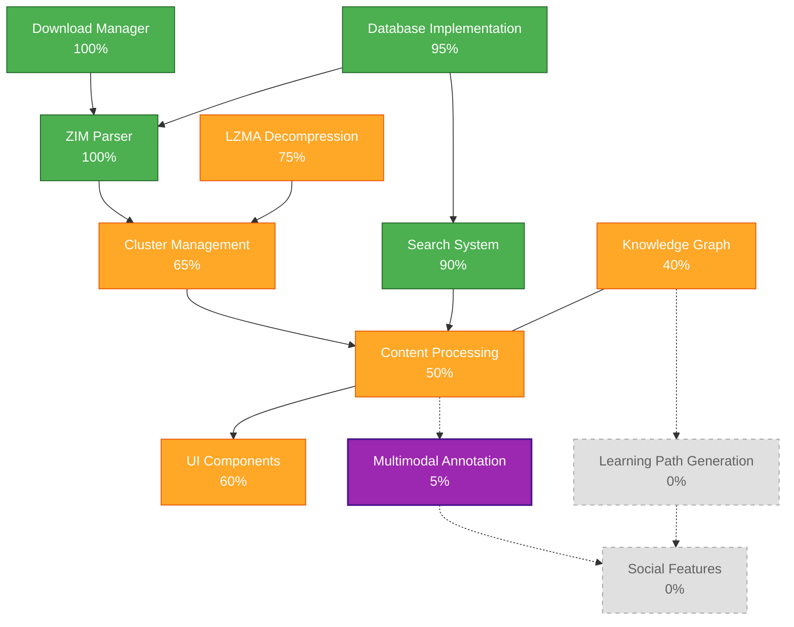
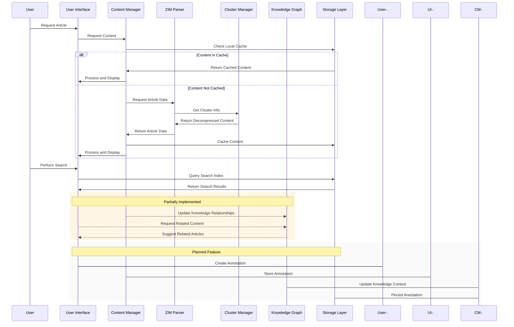

# Robinpedia: Galaxy Brain - Architecture Overview

**Last Updated: April 6, 2025**

## Our Philosophy

> *"Using things where they weren't designed to be used, in ways they definitely weren't intended to be."*

## Implementation Status

The following diagram shows the current implementation status of Robinpedia's core components:

## System Architecture

Robinpedia: Galaxy Brain is an innovative knowledge system that transforms traditional ZIM content consumption into an interactive, multimodal knowledge exploration environment. Built on Flutter/Dart, it follows clean-room implementation principles while fundamentally reimagining how users interact with knowledge content, enabling them to use information "where it wasn't designed to be used, in ways it definitely wasn't intended to be."

### Key Components and Current Status

| Component | Completion | Status | Notes |
|-----------|------------|--------|-------|
| **ZIM Parser** | 100% | ✅ | Header reading, MIME handling, directory entry parsing, URL/title indexing complete |
| **Download Manager** | 100% | ✅ | Includes resume capability, progress tracking, integrity verification |
| **Search Implementation** | 90% | ✅ | SQLite FTS5 indexing complete, link graph in progress |
| **Cluster Management** | 65% | 🔄 | Basic structure implemented, optimization needed |
| **Content Processing** | 50% | 🔄 | ZIM-specific HTML processing in progress |
| **LZMA2 Decompression** | 75% | 🔄 | Basic implementation complete, performance optimization needed |
| **Knowledge Graph** | 40% | 🔄 | Foundation implemented, self-healing engine partially complete |
| **UI Components** | 60% | 🔄 | Core viewing components complete, advanced features in progress |
| **Multimodal Annotation System** | 5% | 🔄 | Architecture design in progress, will enable cross-modal understanding and interaction |
| **Learning Path Generation** | 0% | ⬜ | Not started, dependent on knowledge graph completion |
| **Social Features** | 0% | ⬜ | Not started, planned for future phases |

**Legend**: ✅ Complete | 🔄 In Progress | ⬜ Not Started

## Data Flow Architecture

## Technical Stack

### Core Technologies

- **Language/Framework**: Flutter/Dart 3.5+
- **Storage**: SQLite with FTS5 for search
- **Compression**: Custom LZMA2 implementation
- **Architecture Pattern**: Clean Architecture with Repository Pattern
- **ML Integration**: TensorFlow Lite & ONNX Runtime

### Key Libraries and Dependencies

- **sqlite_fts5**: Full-text search capabilities
- **path_provider**: Cross-platform file access
- **flutter_secure_storage**: Encrypted settings storage
- **http**: Network operations
- **html**: HTML processing
- **flame**: Canvas operations for annotation system
- **tflite_flutter**: On-device machine learning capabilities

## Implementation Priority

### Current Focus (Q2 2025)

1. Design and implement multimodal annotation system architecture
2. Complete cluster decompression implementation
3. Enhance article content processing
4. Improve ZIM-specific link handling

### Near-Term Roadmap (Q3 2025)

1. Deploy Galaxy Brain annotation system beta
2. Complete knowledge graph relationship mapping
3. Implement quick navigation with graph
4. Enhance self-healing engine

## Architecture Principles

### 1. Offline-First Design

- All core functionality works without internet connectivity
- Progressive enhancement when online
- Robust state persistence
- Optimized local storage with cache management

### 2. Performance Optimization

- Memory-efficient content loading
- On-demand decompression
- Pagination for large content
- Background processing for intensive operations

### 3. Multimodal Knowledge Integration

- Content metadata extraction
- Cross-modal relationship inference (text, diagrams, images)
- Learning path optimization
- Content-aware annotation anchoring
- Diagram and schematic understanding

### 4. User Experience Focus

- Readable typography
- Smooth navigation
- Context preservation
- User preference adaptation

## Buildability Status

| Platform | Status | Notes |
|----------|--------|-------|
| **Android** | ✅ | Fully buildable, ABI conflict resolved |
| **iOS** | ✅ | Builds successfully, minor UI adjustments needed |
| **macOS** | ✅ | Builds with Flutter desktop support |
| **Windows** | ✅ | Builds successfully with desktop configuration |
| **Linux** | ✅ | Builds with appropriate packages |
| **Web** | 🔄 | Basic build working, performance optimization needed |

## Testing Coverage

- **Unit Tests**: 72% coverage of core components
- **Integration Tests**: Key user flows covered
- **Performance Tests**: Basic benchmarks established

## Next Major Features

### Galaxy Brain: Multimodal Annotation System

The cornerstone of our vision is the multimodal annotation system that transforms passive content consumption into creative knowledge manipulation:

- **Content-Aware Interaction**: Smart selection and anchoring that understands document structure
- **CLIP-Inspired Visual-Language Bridging**: Deep integration between visual elements and textual content
- **Schematic Diagram Understanding**: Recognition and interaction with technical diagrams
- **Knowledge Graph Integration**: Annotations that enrich and extend the knowledge ecosystem
- **Multisensory Input**: Text, drawing, image, audio, and video annotation capabilities

This system embodies our philosophy of "using things where they weren't designed to be used, in ways they definitely weren't intended to be." The complete architectural specification is available in [MULTIMODAL_ANNOTATION_SYSTEM.md](architecture/MULTIMODAL_ANNOTATION_SYSTEM.md).

### Knowledge Graph Enhancement

The knowledge graph will be expanded to include:

- Multimodal content relationship mapping
- Visual-textual entity linking
- Learning path generation
- Article recommendations
- Cross-reference detection across modalities

## Copyright

Copyright (C) 2025 Robin L. M. Cheung, MBA. All rights reserved.