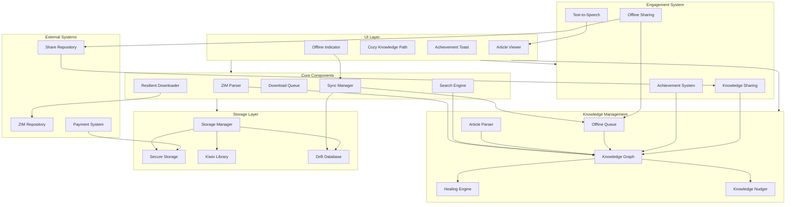
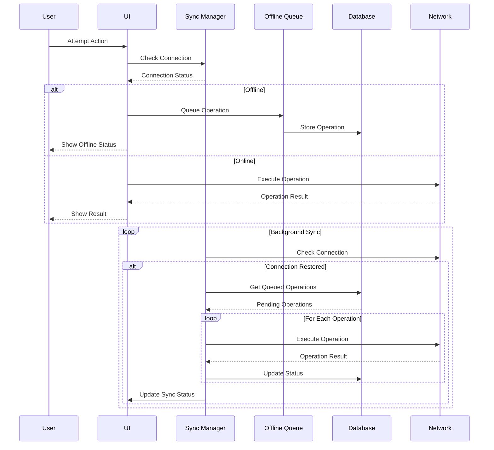
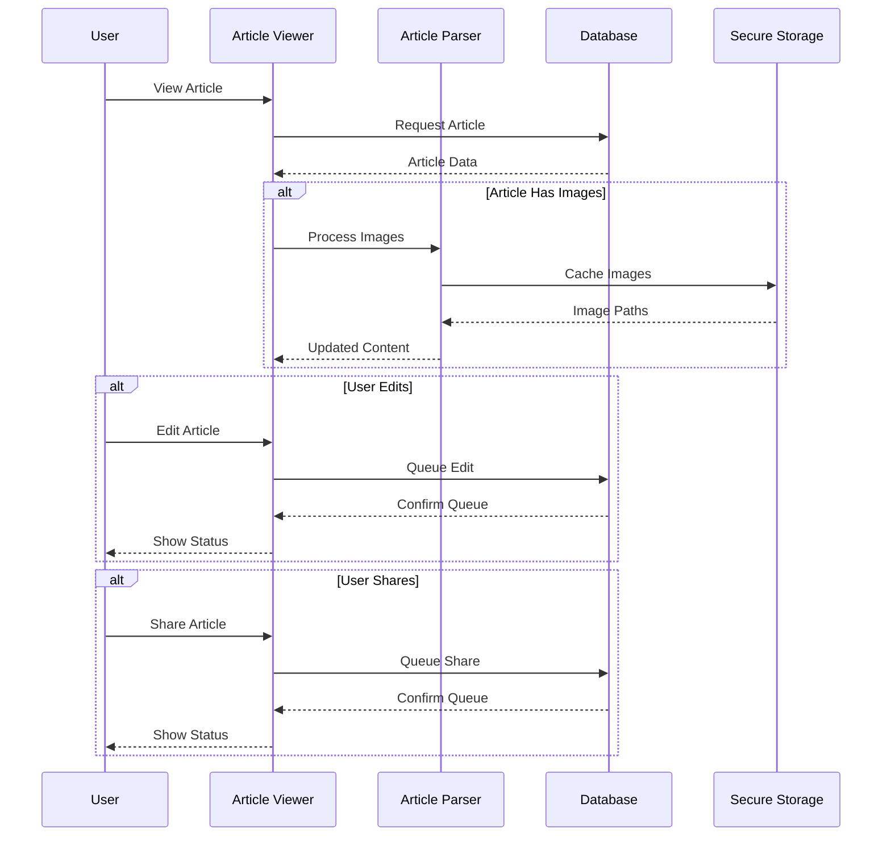
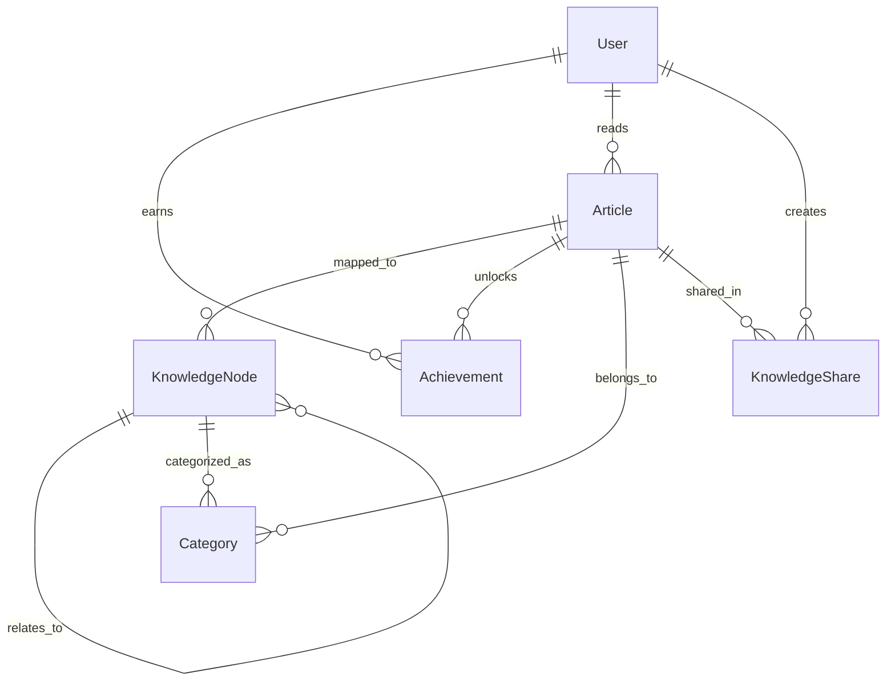

# Robinpedia System Diagrams

## System Architecture



## Offline Data Flow



## Article Management Flow



## Entity Relationships



## Component States

```mermaid
stateDiagram-v2
    [*] --> Idle
    
    state "Content Management" as CM {
        Idle --> Downloading
        Downloading --> Processing
        Processing --> Ready
        Ready --> Idle
        Downloading --> Error
        Error --> Idle
    }
    
    state "Knowledge Graph" as KG {
        Ready --> Learning
        Learning --> Healing
        Healing --> Ready
    }
    
    state "User Engagement" as UE {
        Ready --> Reading
        Reading --> Achieving
        Reading --> Sharing
        Achieving --> Ready
        Sharing --> Ready
    }
