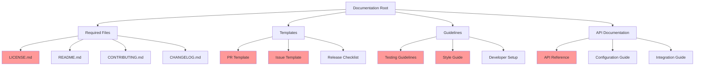

# Documentation Update Plan

## Gap Analysis

## Prioritized Morning Tasks

### 1. Update CHANGELOG and API Documentation (30 min)
- [ ] Review and update CHANGELOG.md entries
  - Verify all recent changes are documented
  - Add missing implementation details
  - Ensure proper versioning
- [ ] Create initial API.md documentation
  - Document core API endpoints
  - Include authentication requirements
  - Add request/response examples

### 2. Fix Critical Files (30 min)
- [ ] Move LICENSE.md to repository root
- [ ] Update README.md broken links
- [ ] Expand CONTRIBUTING.md guidelines

### 3. Add Documentation Templates (15 min)
- [ ] Create .github/ISSUE_TEMPLATE directory
- [ ] Create .github/PULL_REQUEST_TEMPLATE directory
- [ ] Add basic templates for:
  - Bug reports
  - Feature requests
  - Pull requests

### 4. Create Development Guidelines (15 min)
- [ ] Add testing guidelines
- [ ] Create style guide
- [ ] Update developer setup instructions

## Implementation Steps

1. **Documentation Structure Update**
   - Implement proper file organization
   - Fix file locations according to standard conventions
   - Update internal cross-references

2. **Content Creation and Updates**
   - Write missing documentation sections
   - Update outdated content
   - Validate all links and references

3. **Review Process**
   - Technical review of API documentation
   - Validation of all templates
   - Verification of guidelines

4. **Final Verification**
   - Check all documentation links
   - Validate markdown formatting
   - Ensure consistent style across docs

## Success Criteria
- [ ] All critical documentation in place
- [ ] Templates available and tested
- [ ] Guidelines clear and comprehensive
- [ ] All cross-references valid
- [ ] CHANGELOG.md up to date
- [ ] API documentation complete

## Notes
- Priority adjustments may be needed based on team feedback
- Documentation should align with latest implementation
- Regular reviews needed to maintain accuracy