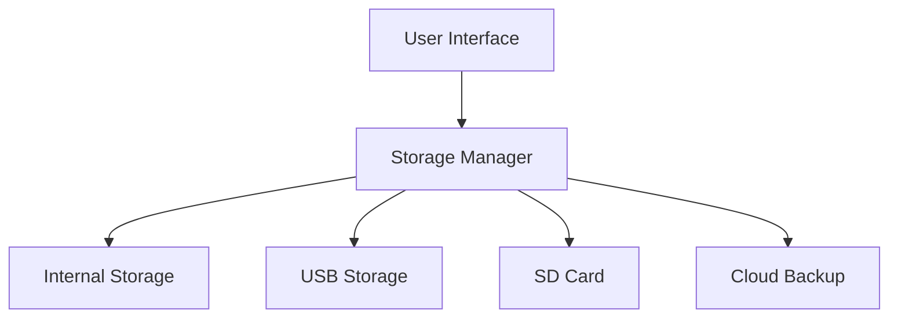
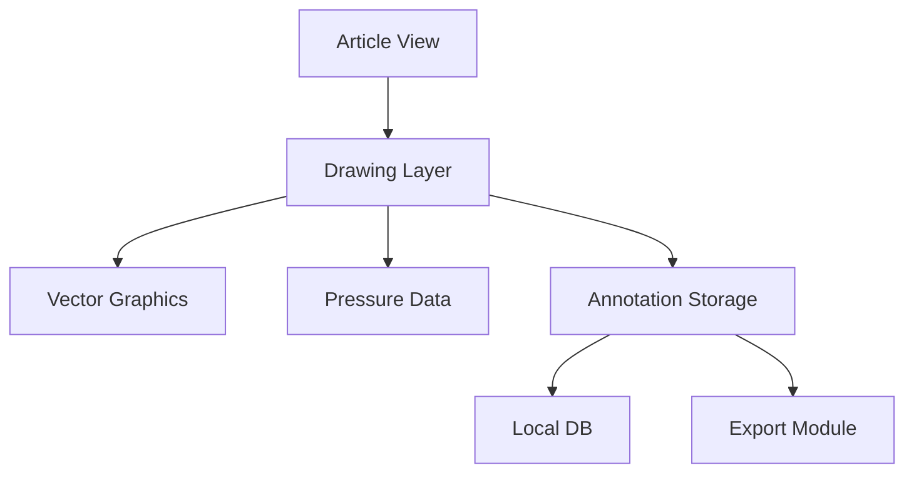
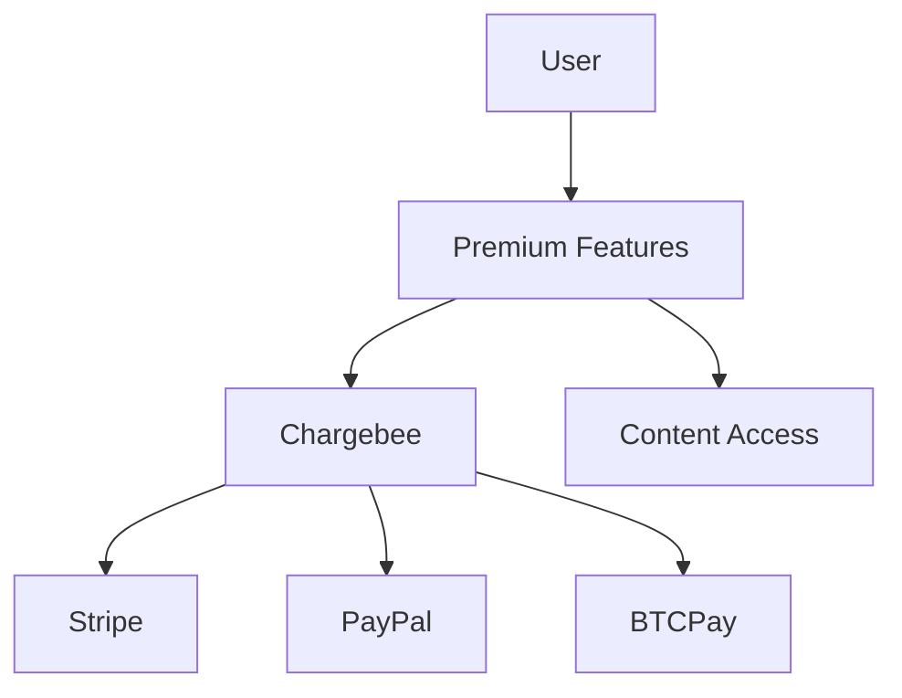

# 8-Hour Implementation Plan

## Platform Priority
1. Mobile (95% of expected usage)
   - Android: Primary focus
   - iOS: Primary focus
2. Web: Secondary priority
   - Progressive Web App (PWA) support
   - Subscription flow optimization
3. Desktop
   - Windows: Tertiary priority

## Core Features (Priority Order)

### Phase 1: Essential Mobile & Engagement 🎯
- [✓] Basic header reading
- [/] Download manager
  - [✓] Basic file operations
  - [/] Resume capability
  - [ ] Progress tracking
  - [ ] Mobile storage optimization
- [ ] User Engagement Features 🪝
  - [ ] "Did You Know...?" system
    - [ ] Context-aware fun facts
    - [ ] Random interesting tangents
    - [ ] "Down the rabbit hole" suggestions
    - [ ] Text-to-Speech storytelling
      - [ ] Activates during idle periods
      - [ ] "Hey, want to hear something cool about..."
      - [ ] Ambient reading mode
      - [ ] Voice style selection
  - [ ] Reading Streaks & Rewards
    - [ ] Daily reading goals
    - [ ] Topic exploration achievements
    - [ ] "Wiki Wanderer" badges
    - [ ] "Night Owl" achievements for 3am wiki sessions
  - [ ] Social Sharing
    - [ ] Share interesting facts
    - [ ] Challenge friends to explore topics
    - [ ] "You won't believe what I just learned..." templates
- [/] Article content parsing
- [ ] Link extraction
- [ ] Image handling
- [ ] Error handling

### Phase 2: Enhanced Engagement 🎮
- [ ] Knowledge Gamification
  - [ ] Topic mastery levels
  - [ ] Learning pathways
  - [ ] Achievement system
  - [ ] "Wiki Storyteller" mode
    - [ ] AI-powered narrative connections
    - [ ] Voice-guided exploration
    - [ ] Ambient background sounds
- [ ] Interactive Features
  - [ ] Article highlights
  - [ ] Personal annotations
  - [ ] Reading history visualization
  - [ ] Voice commands for navigation

### Phase 3: Payment & Premium Features 💎
- [ ] Basic Subscription
  - [ ] Chargebee integration
  - [ ] Mobile-friendly flow
- [ ] Premium Engagement Features
  - [ ] Custom learning paths
  - [ ] Advanced statistics
  - [ ] Ad-free experience

### Phase 4: Web Platform Support
- [ ] Progressive Web App setup
- [ ] Web-based engagement features
- [ ] Service Worker implementation
- [ ] IndexedDB storage
- [ ] Offline article access
- [ ] Cross-platform sync

### Phase 5: Windows Desktop Support
- [ ] Native installer
- [ ] Desktop-optimized UI
- [ ] System tray integration
- [ ] Auto-updates

### Phase 6: Knowledge Enhancement
- [ ] Annotation System
  - [ ] Freehand drawing on articles
  - [ ] Stylus support for tablets
  - [ ] Cross-platform sync
  - [ ] Personal notes attachment
  - [ ] Export annotations

### Phase 7: Advanced Features
- [ ] WikiRAGe Assistant
  - [ ] Offline LLM integration
  - [ ] Knowledge navigation
  - [ ] Custom Q&A
  - [ ] Topic connections and insights

### Phase 8: Prepper-Focused Features
- [ ] Category-based emergency guides
- [ ] Offline skill indexing
- [ ] Resource requirement tracking
- [ ] Emergency checklists
- [ ] Location-based resource mapping

## Status Key
- [ ] Not started
- [/] In progress
- [X] Code complete but untested
- [✓] Tested and battle-proven

## Hour-by-Hour Plan

### Hour 1-2: Core Infrastructure
- [/] Complete documentation setup
- [/] Implement download manager
- [/] Set up storage handling
- [/] Implement offline-first architecture

### Hour 3-4: Payment & Subscription
- [ ] Chargebee setup
- [ ] Mobile-friendly subscription flow
- [ ] Payment processing (Stripe/PayPal)
- [ ] Subscription management

### Hour 5-6: Annotation System
- [ ] Drawing canvas implementation
- [ ] Stylus pressure sensitivity
- [ ] Annotation storage system
- [ ] Export functionality

### Hour 7: Premium Features
- [ ] WikiRAGe integration
- [ ] Offline LLM setup
- [ ] Knowledge graph visualization
- [ ] Custom collections

### Hour 8: Polish & Testing
- [ ] UI/UX refinement
- [ ] Performance optimization
- [ ] Offline capability testing
- [ ] Payment flow testing

## Technical Architecture

### Storage Layer


### Annotation System


### Payment Flow


## Development Reality

```mermaid
xychart-beta
    title "Ship It vs Perfect It"
    x-axis [0, 1, 2, 3] "Time →"
    y-axis "Done %" 0 --> 100
    line ["Perfect", "Ship"]
    plot [
        [100, 0],
        [100, 60],
        [100, 90],
        [100, 95]
    ]
```

> "Perfect is the enemy of shipped" - Ancient Prepper Wisdom

## Current Progress Status

### Completed (✓)
- Basic app structure
- ZIM parser foundation
- Cross-platform configuration
- Storage management
- Download system

### In Progress (🚧)
- Annotation system
- Premium features
- Payment integration
- Offline LLM integration

### Next Steps
1. Implement drawing canvas
2. Set up Chargebee integration
3. Begin WikiRAGe development
4. Add prepper-specific features
