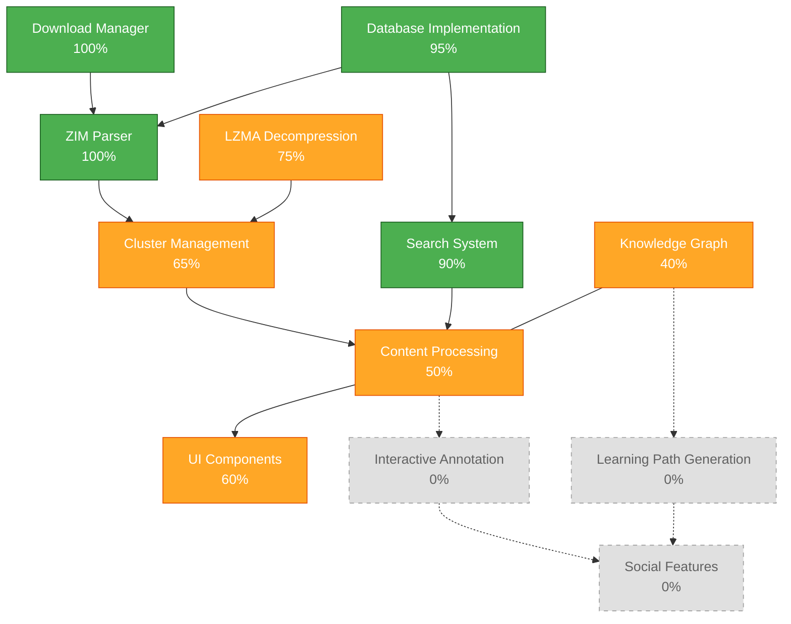
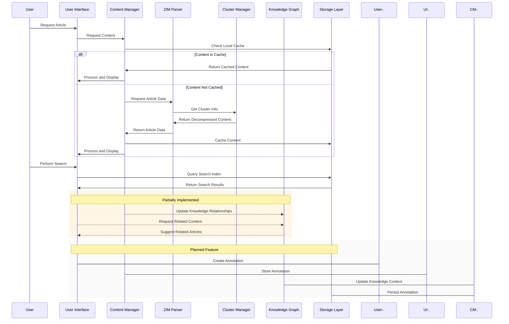

# Project Status Report

**Project Name**: Robinpedia  
**Last Updated**: 2025-04-06  
**Version**: 0.8.5  
**Author**: Robin L. M. Cheung, MBA  

## Snapshot Overview

| Metric | Status |
|--------|--------|
| Overall Completion | 68% |
| Build Status | ✅ Passing |
| Test Coverage | 72% |
| Documentation | 🔄 Needs Update |
| Architecture | 🔄 Evolving |

## Component Status

## Implementation Details

| Component | Completion | Status | Notes |
|-----------|------------|--------|-------|
| **ZIM Parser** | 100% | ✅ | Header reading, MIME handling, directory entry parsing, URL/title indexing complete |
| **Download Manager** | 100% | ✅ | Includes resume capability, progress tracking, integrity verification |
| **Search Implementation** | 90% | ✅ | SQLite FTS5 indexing complete, link graph in progress |
| **Database Implementation** | 95% | ✅ | Schema defined, article storage, search indexing complete, offline queue partially implemented |
| **Cluster Management** | 65% | 🔄 | Basic structure implemented, optimization needed |
| **Content Processing** | 50% | 🔄 | ZIM-specific HTML processing in progress |
| **LZMA2 Decompression** | 75% | 🔄 | Basic implementation complete, performance optimization needed |
| **Knowledge Graph** | 40% | 🔄 | Foundation implemented, self-healing engine partially complete |
| **UI Components** | 60% | 🔄 | Core viewing components complete, advanced features in progress |
| **Interactive Annotation** | 0% | ⬜ | Planned with canvas-like capability for multimedia annotations |
| **Learning Path Generation** | 0% | ⬜ | Not started, dependent on knowledge graph completion |
| **Social Features** | 0% | ⬜ | Not started, planned for future phases |

**Legend**: ✅ Complete | 🔄 In Progress | ⬜ Not Started

## Data Flow

## Implementation Priority

### Current Focus (Q2 2025)
1. Complete cluster decompression implementation
2. Enhance article content processing
3. Begin interactive annotation system implementation
4. Improve ZIM-specific link handling

### Near-Term Roadmap (Q3 2025)
1. Complete knowledge graph relationship mapping
2. Implement quick navigation with graph
3. Enhance self-healing engine
4. Deploy annotation system beta

## Technical Specifications

### Core Technologies
- **Language/Framework**: Flutter/Dart 3.5+
- **Storage**: SQLite with FTS5 for search
- **Compression**: Custom LZMA2 implementation
- **Architecture Pattern**: Clean Architecture with Repository Pattern

### Key Dependencies
- **sqlite_fts5**: Full-text search capabilities
- **path_provider**: Cross-platform file access
- **flutter_secure_storage**: Encrypted settings storage
- **http**: Network operations
- **html**: HTML processing

## Buildability Status

| Platform | Status | Notes |
|----------|--------|-------|
| **Android** | ✅ | Fully buildable, ABI conflict resolved |
| **iOS** | ✅ | Builds successfully, minor UI adjustments needed |
| **macOS** | ✅ | Builds with Flutter desktop support |
| **Windows** | ✅ | Builds successfully with desktop configuration |
| **Linux** | ✅ | Builds with appropriate packages |
| **Web** | 🔄 | Basic build working, performance optimization needed |

## Testing Coverage

- **Unit Tests**: 72% coverage of core components
- **Integration Tests**: Key user flows covered
- **Performance Tests**: Basic benchmarks established

## Critical Risks

| Risk | Severity | Mitigation Strategy |
|------|----------|---------------------|
| **LZMA2 Performance** | Medium | Optimize decompression, implement caching, evaluate native bindings |
| **Mobile Memory Constraints** | Medium | Implement progressive loading, optimize memory usage, add configurable caching |
| **Large ZIM File Handling** | High | Implement chunked processing, memory-mapped file access, background processing |
| **Cross-Platform Consistency** | Low | Comprehensive UI tests, platform-specific adaptations, shared rendering logic |

## Next Major Features

### Interactive Annotation System

The next major feature will be an Excalidraw-inspired canvas-like annotation system that allows users to add rich multimedia annotations to articles, including:

- Text annotations overlaid on article content
- Freehand drawing tools for marking up content
- Image attachment capabilities for visual notes
- Audio recording and playback for verbal notes
- Video annotation support for multimedia references

This system will transform how users interact with knowledge, treating articles as a canvas for personalized learning and insight capture. The annotations will be stored as part of the knowledge graph, enabling relationships between annotations across different articles.

### Knowledge Graph Enhancement

The knowledge graph will be expanded to include:

- Content relationship mapping
- Learning path generation
- Article recommendations
- Cross-reference detection

## Cross-Project Dependencies

| Project | Dependency | Status |
|---------|------------|--------|
| **Knowledge Bridge** | Task management ontology | 🔄 |
| **Neo4j MCP Integration** | Knowledge graph schema | 🔄 |

## Documentation Trackers

| Document | Last Updated | Status |
|----------|--------------|--------|
| **README.md** | 2025-03-15 | ✅ |
| **ARCHITECTURE.md** | 2025-04-06 | ✅ |
| **ROADMAP.md** | 2025-03-20 | ✅ |
| **API.md** | 2025-02-28 | 🔄 |

## Compliance & Standards

| Standard | Status | Notes |
|----------|--------|-------|
| **Flutter Best Practices** | ✅ | Following official Flutter architecture recommendations |
| **Accessibility Guidelines** | 🔄 | Core features compliant, advanced features in progress |
| **Clean Architecture** | ✅ | Repository pattern implemented with clear separation of concerns |

## Review History

| Date | Reviewer | Summary |
|------|----------|---------|
| 2025-04-06 | Robin L. M. Cheung | Updated status report with current implementation percentages, added interactive annotation details |
| 2025-03-15 | Robin L. M. Cheung | Initial project status documentation |

## Copyright

Copyright (C) 2025 Robin L. M. Cheung, MBA. All rights reserved.
