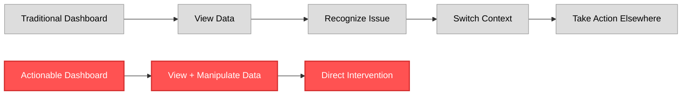
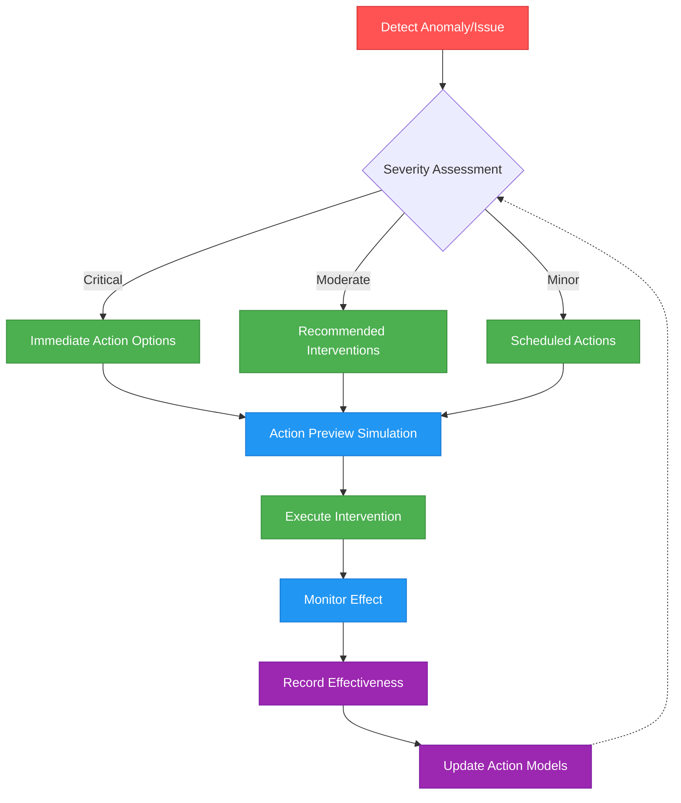
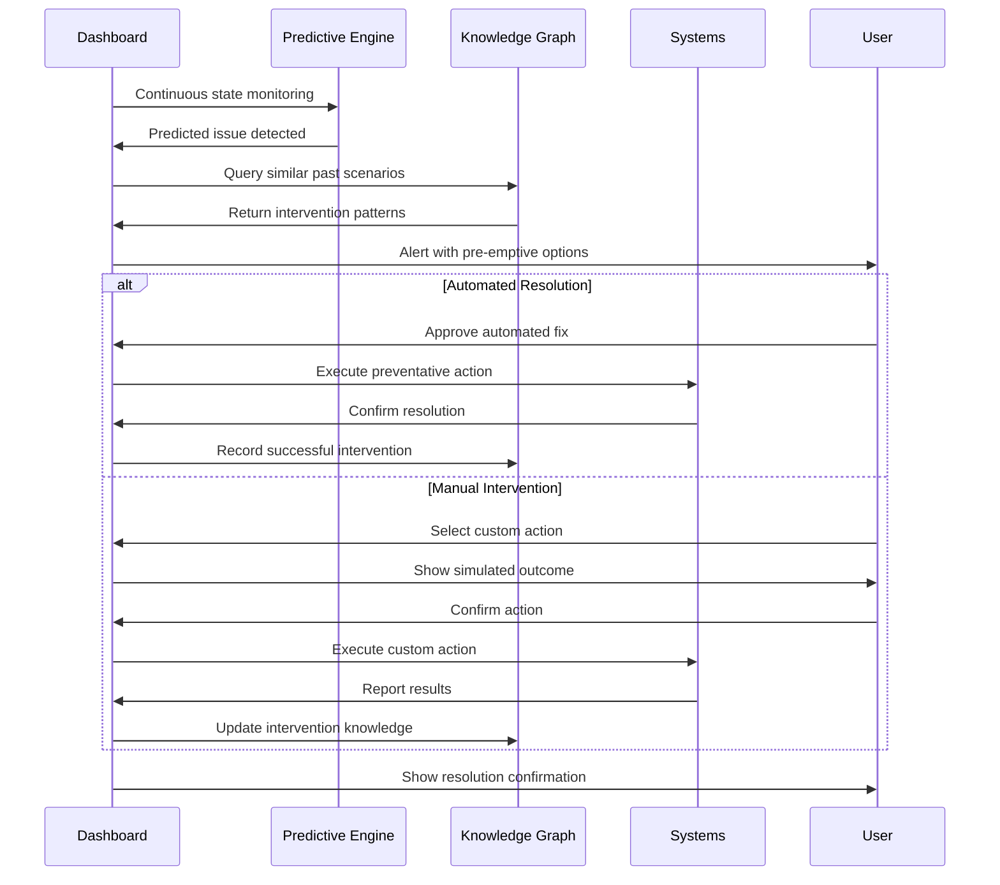

# Actionable Dashboard Architecture

**Version**: 1.0.0  
**Date**: 2025-04-06  
**Author**: Robin L. M. Cheung, MBA  
**Classification**: Visionary Framework / Bidirectional Control System

## Beyond Passive Observation

Traditional dashboards are fundamentally flawed - they treat users as passive observers, forced to watch disasters unfold in real-time without direct intervention capabilities. This architecture rejects that paradigm entirely, creating a bidirectional command center that enables immediate action from any visualization.



## Core Principles

1. **Direct Action Integration**
   - Every visualization is a potential action trigger
   - No separation between monitoring and intervention
   - Context-aware action options generated for current view

2. **Proactive Alert-Action Pairing**
   - Alerts come bundled with recommended actions
   - One-click intervention options for common scenarios
   - Automated impact analysis for proposed actions

3. **Command Center Paradigm**
   - Dashboard as mission control, not just information display
   - Comprehensive control capabilities for all systems
   - Real-time feedback loops showing action impacts

4. **Collective Intelligence**
   - Dashboard learns from previous interventions
   - Builds action recommendation models
   - Anticipates potential issues and pre-suggests interventions

## Intervention Mechanisms



## Bidirectional Capabilities

### 1. Repository Management

**View + Action Integration:**
- Git branch visualization with direct merge/rebase controls
- Commit history with integrated cherry-pick, revert, and squash actions
- Dependency graphs with one-click update triggers
- Build status with direct deploy/rollback options

**Example Interaction:**
```
User notices failing build in CI/CD pipeline visualization
↓
Dashboard highlights affected components and dependencies
↓
User selects "Inspect Failure" directly from visualization
↓
Dashboard presents error logs with inline fix options
↓
User selects auto-fix or manually corrects issue
↓
Dashboard triggers rebuild and reports status in real-time
```

### 2. Project Status Manipulation

**View + Action Integration:**
- Component status visualization with direct prioritization controls
- Resource allocation charts with drag-and-drop reassignment
- Timeline visualization with interactive milestone adjustments
- Risk assessment with direct mitigation action triggers

**Example Interaction:**
```
User identifies component falling behind schedule in visualization
↓
Dashboard highlights resource constraints and dependencies
↓
User drags additional resources to component directly in visualization
↓
Dashboard recalculates timelines and updates all affected visualizations
↓
User approves changes, triggering automatic updates to PROJECT_STATUS.md
```

### 3. Knowledge Graph Operations

**View + Action Integration:**
- Entity relationship visualization with direct editing
- Knowledge gap identification with automatic research triggers
- Pattern recognition with one-click generalization actions
- Conflicting information highlights with resolution interfaces

**Example Interaction:**
```
User notices missing relationship between concepts in hKG visualization
↓
Dashboard suggests potential relationships based on existing patterns
↓
User selects appropriate relationship type directly in visualization
↓
Dashboard updates hKG and propagates changes to all affected systems
↓
New knowledge triggers automatic updates to related documentation
```

### 4. Infrastructure Management

**View + Action Integration:**
- System resource visualization with scaling controls
- Network topology with direct routing configuration
- Storage utilization with automated cleanup/optimization triggers
- Service health indicators with restart/reconfigure options

**Example Interaction:**
```
User notices high CPU usage on service in resource visualization
↓
Dashboard presents process details and potential causes
↓
User selects "Optimize" directly from visualization
↓
Dashboard applies optimization strategies and monitors effect
↓
System automatically documents intervention and outcome
```

## Technical Implementation

The implementation requires a fundamentally different architecture than traditional dashboards:

1. **Action-Oriented Data Structure**
   - All state representations include associated action endpoints
   - Data model embeds permissions and capability information
   - Reactive data structures with bidirectional binding

2. **Command Pattern Infrastructure**
   - All actions implemented through standardized command interfaces
   - Command history with undo/redo capabilities
   - Transactional approach to state changes

3. **Simulation Engine**
   - In-memory modeling of potential action outcomes
   - Visual preview of system state after proposed action
   - Risk assessment for all interventions

4. **Learning Feedback Loop**
   - Capture of action effectiveness metrics
   - Progressive reinforcement of successful patterns
   - Automated suggestion refinement

## Implementation Approach

### Phase 1: Action Foundation (1-2 months)
- Create unified command interface across all systems
- Implement basic visualization with embedded action triggers
- Develop repository and project status direct manipulation
- Deploy transaction logging and undo capabilities

### Phase 2: Smart Intervention (2-3 months)
- Implement proactive anomaly detection
- Develop action recommendation engine
- Create simulation previews for common actions
- Deploy knowledge graph direct manipulation

### Phase 3: Autonomous Operations (3-4 months)
- Implement learning models for intervention effectiveness
- Develop autonomous intervention for routine issues
- Create impact analysis system for complex actions
- Deploy full bidirectional synchronization

## Comparative Advantage

The architecture provides several critical advantages compared to traditional approaches:

1. **Rapid Response Capability**
   - Issues addressed at the moment of detection
   - No context switching between monitoring and action
   - Reduced mean time to resolution

2. **Decision Support**
   - Action options presented with predicted outcomes
   - Historical effectiveness data for similar actions
   - Risk-weighted alternatives

3. **Learning System**
   - Dashboard becomes more effective over time
   - Captures successful intervention patterns
   - Builds organizational knowledge about effective responses

4. **Single Source of Truth and Action**
   - No divergence between display and control systems
   - Consistent interface for all operations
   - Complete action history integrated with state history

## Flutter-Based Implementation

Leveraging our expertise in Flutter, the implementation will feature:

1. **Unified Widget Architecture**
   - Every visualization widget has embedded controller capabilities
   - Standardized action interface for all components
   - Consistent interaction patterns across the entire system

2. **Direct hKG Integration**
   - Real-time binding to knowledge graph
   - Transactional updates to ensure consistency
   - Bidirectional change propagation

3. **Modular Command Structure**
   - Plugin architecture for action providers
   - Dynamically generated action menus based on context
   - Command composition for complex operations

## Use Case: Preventing Disasters Before They Happen



## Evaluation Metrics

The effectiveness of this action-oriented dashboard will be measured by:

1. **Intervention Time**
   - Time from issue detection to resolution initiation
   - Target: <30 seconds for critical issues

2. **Resolution Effectiveness**
   - Success rate of dashboard-initiated interventions
   - Target: >90% first-attempt resolution

3. **Proactive Prevention**
   - Percentage of potential issues resolved before impact
   - Target: >70% of detectable issues

4. **Learning Rate**
   - Improvement in recommendation accuracy over time
   - Target: 5% monthly improvement in first 6 months

## Conclusion

This actionable dashboard architecture fundamentally reimagines what a dashboard can be - not a passive window into system state, but an active command center that enables immediate intervention at the point of awareness. By eliminating the artificial boundary between observation and action, we create a system that extends our capabilities as a nimble duo, allowing us to operate with the effectiveness of a much larger team while maintaining our agility advantage.

The result is not just a dashboard that shows what's happening, but one that empowers us to directly shape what happens next - transforming potential disasters into opportunities for proactive improvement.

## Copyright

Copyright (C) 2025 Robin L. M. Cheung, MBA. All rights reserved.
