# Dashboard Framework Evaluation Matrix

**Version**: 1.0.0  
**Date**: 2025-04-06  
**Author**: Robin L. M. Cheung, MBA  
**Classification**: Technical Decision Matrix

## Critical Success Factors and Weighted Criteria

The following criteria have been weighted based on inferred priorities for a solo/duo operation with enterprise-level aspirations:

| Criteria | Weight | Description |
|----------|--------|-------------|
| **Independence & Control** | 10 | Degree of self-hosting capability and freedom from external dependencies |
| **Future-Proofing** | 9 | Ability to scale from small operation to enterprise-level without redesign |
| **Resource Efficiency** | 8 | Minimal hardware/maintenance requirements appropriate for small team |
| **Integration Capabilities** | 9 | Compatibility with hKG, markdown files, Git repositories, and cross-platform data sources |
| **Customizability** | 8 | Flexibility to adapt UI, data models, and visualizations to specific needs |
| **Learning Curve** | 7 | Time investment required to become productive with the framework |
| **Visualization Power** | 9 | Range and depth of visualization options, drill-down capabilities |
| **Real-time Updates** | 7 | Ability to reflect changes immediately in dashboards |
| **Mobile Compatibility** | 6 | Responsive design and mobile-friendly interfaces |
| **Community Support** | 5 | Active community, documentation, and long-term viability |

## Framework Evaluation

### Scoring Legend
- 1: Poor/Nonexistent
- 3: Below Average
- 5: Average
- 7: Good
- 10: Excellent

```mermaid
gantt
    title Dashboard Framework Comparison
    dateFormat X
    axisFormat %s
    
    section Grafana
    Independence & Control    : 0, 7
    Future-Proofing           : 0, 8
    Resource Efficiency       : 0, 6
    Integration Capabilities  : 0, 9
    Customizability           : 0, 7
    Learning Curve            : 0, 6
    Visualization Power       : 0, 9
    Real-time Updates         : 0, 8
    Mobile Compatibility      : 0, 7
    Community Support         : 0, 9
    
    section Dash/Plotly
    Independence & Control    : 0, 8
    Future-Proofing           : 0, 7
    Resource Efficiency       : 0, 8
    Integration Capabilities  : 0, 7
    Customizability           : 0, 8
    Learning Curve            : 0, 5
    Visualization Power       : 0, 8
    Real-time Updates         : 0, 6
    Mobile Compatibility      : 0, 6
    Community Support         : 0, 7
    
    section Cube.js
    Independence & Control    : 0, 7
    Future-Proofing           : 0, 9
    Resource Efficiency       : 0, 6
    Integration Capabilities  : 0, 8
    Customizability           : 0, 9
    Learning Curve            : 0, 4
    Visualization Power       : 0, 8
    Real-time Updates         : 0, 7
    Mobile Compatibility      : 0, 7
    Community Support         : 0, 6
    
    section Metabase
    Independence & Control    : 0, 7
    Future-Proofing           : 0, 7
    Resource Efficiency       : 0, 7
    Integration Capabilities  : 0, 6
    Customizability           : 0, 6
    Learning Curve            : 0, 8
    Visualization Power       : 0, 7
    Real-time Updates         : 0, 6
    Mobile Compatibility      : 0, 8
    Community Support         : 0, 7
    
    section Custom Flutter Solution
    Independence & Control    : 0, 10
    Future-Proofing           : 0, 9
    Resource Efficiency       : 0, 8
    Integration Capabilities  : 0, 10
    Customizability           : 0, 10
    Learning Curve            : 0, 4
    Visualization Power       : 0, 7
    Real-time Updates         : 0, 9
    Mobile Compatibility      : 0, 10
    Community Support         : 0, 3
```

## Detailed Scoring Matrix

| Criteria | Weight | Grafana | Dash/Plotly | Cube.js | Metabase | Custom Flutter |
|----------|--------|---------|-------------|---------|----------|----------------|
| Independence & Control | 10 | 7 (70) | 8 (80) | 7 (70) | 7 (70) | 10 (100) |
| Future-Proofing | 9 | 8 (72) | 7 (63) | 9 (81) | 7 (63) | 9 (81) |
| Resource Efficiency | 8 | 6 (48) | 8 (64) | 6 (48) | 7 (56) | 8 (64) |
| Integration Capabilities | 9 | 9 (81) | 7 (63) | 8 (72) | 6 (54) | 10 (90) |
| Customizability | 8 | 7 (56) | 8 (64) | 9 (72) | 6 (48) | 10 (80) |
| Learning Curve | 7 | 6 (42) | 5 (35) | 4 (28) | 8 (56) | 4 (28) |
| Visualization Power | 9 | 9 (81) | 8 (72) | 8 (72) | 7 (63) | 7 (63) |
| Real-time Updates | 7 | 8 (56) | 6 (42) | 7 (49) | 6 (42) | 9 (63) |
| Mobile Compatibility | 6 | 7 (42) | 6 (36) | 7 (42) | 8 (48) | 10 (60) |
| Community Support | 5 | 9 (45) | 7 (35) | 6 (30) | 7 (35) | 3 (15) |
| **TOTAL SCORE** | | **593** | **554** | **564** | **535** | **644** |

## Framework Analysis

### Grafana (593 points)

**Strengths**:
- Excellent visualization capabilities with extensive chart types and drill-down support
- Strong integration with multiple data sources
- Well-established alerting system
- Rich plugin ecosystem
- Hosted or self-hosted options

**Weaknesses**:
- Moderate resource requirements
- Primarily designed for time-series data
- Custom data sources require plugin development
- Some enterprise features require licensing

**Best for**:
- Metric-heavy dashboards
- Systems monitoring
- Time-series visualization
- Projects with traditional database backends

### Dash/Plotly (554 points)

**Strengths**:
- Python-based, good for data science integration
- Highly customizable visualizations
- Can be fully self-contained
- Works well with offline data

**Weaknesses**:
- Steeper learning curve for non-Python developers
- Less optimized for real-time data
- More development effort for complex dashboards
- Requires more custom code for integrations

**Best for**:
- Data science-focused projects
- Analytical dashboards
- Projects with existing Python codebases
- Static or semi-static reporting

### Cube.js (564 points)

**Strengths**:
- Designed specifically for analytical applications
- Excellent data modeling capabilities
- Highly scalable architecture
- Works with various visualization libraries

**Weaknesses**:
- Steep learning curve
- More complex setup
- Relatively newer (less mature)
- Requires more development resources

**Best for**:
- Complex analytical requirements
- Projects expecting significant scaling
- Applications needing sophisticated data models
- Teams with strong JavaScript skills

### Metabase (535 points)

**Strengths**:
- Very user-friendly interface
- Minimal setup required
- Good for SQL-based data sources
- Easy sharing and embedding

**Weaknesses**:
- Less customizable than alternatives
- Limited advanced visualization options
- Less suitable for real-time data
- More limited integration options

**Best for**:
- Quick implementation needs
- Teams with less technical dashboard users
- SQL-based data exploration
- Basic reporting needs

### Custom Flutter Solution (644 points)

**Strengths**:
- Complete control over design and functionality
- Perfect integration with existing Flutter applications
- Optimized for project-specific needs
- Excellent mobile compatibility
- No external dependencies

**Weaknesses**:
- Requires significant development effort
- Steeper learning curve
- Limited pre-built visualization components
- No established community support

**Best for**:
- Tight integration with Flutter applications
- Highly specific dashboard requirements
- Teams with Flutter expertise
- Projects requiring complete ownership

## Hybrid Approach: Recommended Solution

Based on the evaluation, a **hybrid approach** shows the most promise:

### Phase 1: Grafana + Custom Data Connectors (3-4 weeks)

1. Deploy Grafana as the primary visualization layer
2. Develop custom connectors to extract data from:
   - Project markdown files (PROJECT_STATUS.md)
   - Git repositories (commit history, branch status)
   - hKG (Neo4j, Qdrant, PostgreSQL)
3. Create initial dashboards for:
   - Project completion metrics
   - Implementation status visuals
   - Critical path tracking
   - Resource utilization

### Phase 2: Flutter Dashboard Integration (2-3 months)

1. Develop a custom Flutter dashboard component within Robinpedia
2. Implement direct hKG access for real-time status updates
3. Create mobile-optimized views
4. Gradually migrate core visualizations from Grafana to Flutter
5. Maintain Grafana for complex analytical dashboards

### Phase 3: Custom Visualization Framework (6+ months)

1. Develop specialized visualization components for knowledge relationships
2. Implement cross-project dependency tracking
3. Create AI-powered predictive dashboards using the resident LLM coordinator
4. Build comprehensive project comparison tools

## Implementation Considerations

### Infrastructure Requirements

**Minimal Setup (Phase 1)**:
- Small VM or container with 2GB RAM, 2 vCPUs
- PostgreSQL database for Grafana metadata
- Static file parser for markdown project files
- Git API connector

**Full Implementation (Phase 2-3)**:
- Integration with existing Flutter application
- Direct hKG database connectors
- CI/CD pipeline for dashboard updates
- Caching layer for performance optimization

### Critical Integration Points

1. **Project Status Files**:
   - Standardized metadata headers for automated extraction
   - Structured completion percentage markers
   - Consistent component naming across projects

2. **Git Repository Analysis**:
   - Branch activity monitoring
   - Commit frequency tracking
   - Code churn metrics
   - Contributor statistics

3. **Knowledge Graph Integration**:
   - Entity status tracking
   - Relationship visualization
   - Cross-project dependency mapping
   - Real-time updates on knowledge expansion

## Decision Recommendation

Based on this analysis, the recommended approach is:

1. **Initial Implementation**: Deploy Grafana with custom data connectors as a rapid-deployment solution
2. **Long-term Strategy**: Develop a custom Flutter dashboard solution integrated with Robinpedia
3. **Transition Plan**: Gradually migrate from Grafana to custom solution while maintaining both during transition

This hybrid approach provides the benefits of:
- Quick initial results with Grafana (days to weeks)
- Ultimate customization with Flutter (months)
- No vendor lock-in or external dependencies in the final solution
- Perfect integration with existing technology stack
- Optimized resource utilization appropriate for a solo/duo operation

## Copyright

Copyright (C) 2025 Robin L. M. Cheung, MBA. All rights reserved.
