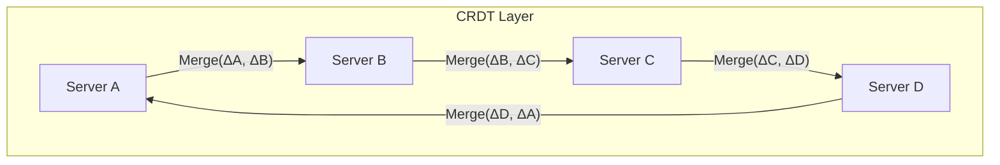
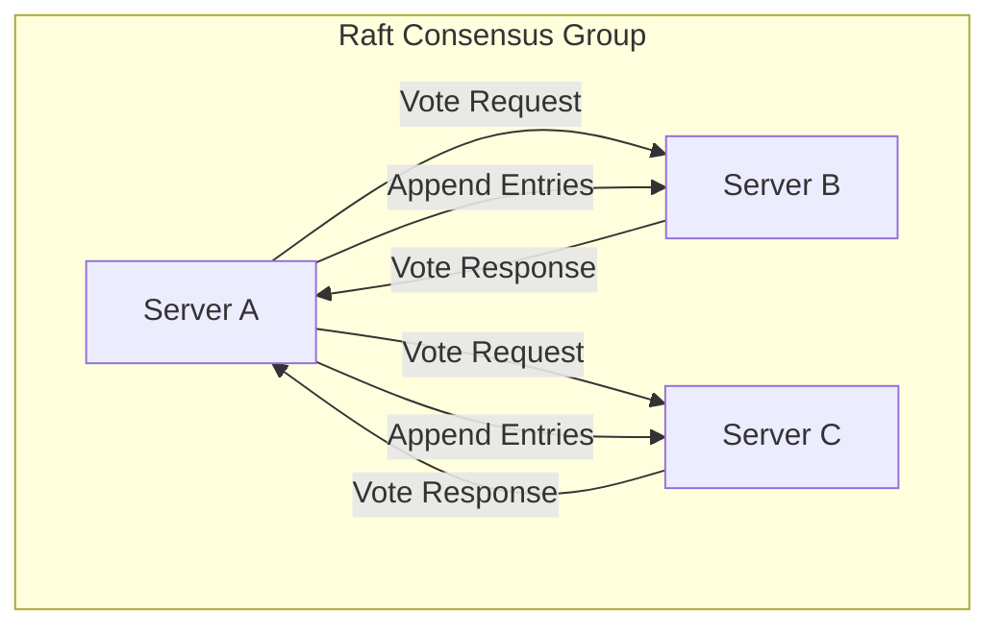
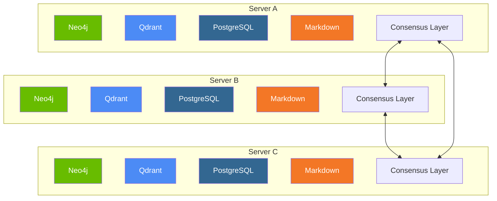

# Distributed Hybrid Knowledge Graph Architecture

**Version**: 1.0.0  
**Date**: 2025-04-06  
**Author**: Robin L. M. Cheung, MBA  
**Classification**: System Architecture / Infrastructure

## Current hKG State Assessment

The hybrid Knowledge Graph (hKG) currently exists across multiple database technologies:

1. **Neo4j**: Stores semantic relationships and conceptual hierarchies
   - Current size: ~1.2GB (estimated)
   - Primary role: Relationship modeling and traversal queries
   - Strengths: Graph relationships, pattern recognition

2. **Qdrant**: Vector database for semantic similarity
   - Current size: ~800MB (estimated)
   - Primary role: Semantic search and clustering
   - Strengths: Concept proximity, fuzzy matching

3. **PostgreSQL**: Stores audit logs and structured project data
   - Current size: ~500MB (estimated)
   - Primary role: Transactional integrity and history
   - Strengths: ACID compliance, complex queries

4. **Local Markdown Files**: Human-readable documentation
   - Current size: ~50MB (estimated)
   - Primary role: Human-readable documentation
   - Strengths: Accessibility without specialized tools

**Total hKG Size**: Approximately 2.5GB across all storage mechanisms

## Distributed Consensus Architecture

To implement a true peer-to-peer architecture with no single master while maintaining a unified source of truth, we will implement a multi-layered consensus mechanism:

### 1. Conflict-Free Replicated Data Types (CRDTs) Layer



- **Implementation**: Yjs or Automerge CRDT libraries
- **Advantages**:
  - Eventual consistency without coordination
  - No leader election needed
  - Automatic conflict resolution
  - Works offline with later synchronization
- **Use Cases**: 
  - Knowledge entities and metadata
  - Project status updates
  - Documentation changes

### 2. Raft Consensus Protocol for Critical Operations



- **Implementation**: etcd or Consul distributed consensus
- **Advantages**:
  - Strong consistency guarantees
  - Clear leader for writes with automatic failover
  - Safe for critical operations
- **Use Cases**:
  - Schema migrations
  - Critical relationship integrity
  - System-wide configuration changes

### 3. Hybrid Storage and Query Mechanism



- **Implementation**: Custom middleware layer
- **Advantages**:
  - Unified query interface
  - Storage technology agnosticism
  - Distributed execution
- **Use Cases**:
  - Cross-database queries
  - Aggregated analytics
  - Federated search

## Implementation Plan

### Phase 1: Distributed Data Model (Immediate)

1. **UUID-Based Identity System**
   - Globally unique identifiers for all entities
   - Logical clock timestamps (Lamport clocks)
   - Entity signatures for integrity verification

2. **Version Vector System**
   - Track lineage of all knowledge entities
   - Support multi-branch reconciliation
   - Detect concurrent modifications

3. **Schema Verification Layer**
   - JSON Schema validation for all data
   - Cross-database constraint checking
   - Dynamic schema evolution

### Phase 2: Synchronization Infrastructure (Hardware Transition)

1. **WebSocket/gRPC Communication Layer**
   - Low-latency change propagation
   - Bidirectional streaming for real-time updates
   - Authentication and encryption

2. **Intelligent Routing Layer**
   - Content-based message routing
   - Priority-based synchronization
   - Bandwidth-aware transmission

3. **State Synchronization Protocol**
   - Merkle tree difference detection
   - Partial state transfers
   - Compact delta encoding

### Phase 3: Resilience Mechanisms (Post-Transition)

1. **Failure Detection System**
   - Heartbeat monitoring
   - Byzantine fault detection
   - Automated node exclusion/inclusion

2. **Anti-Entropy Protocol**
   - Periodic full synchronization
   - Integrity verification
   - Historical state reconstruction

3. **Backup and Recovery**
   - Continuous incremental snapshots
   - Point-in-time recovery capability
   - Cross-node backup verification

## Immediate Implementation Requirements

To prepare for tomorrow's hardware transition:

1. **Emergency Data Export Protocol**
   - Create a compressed snapshot of the current hKG state
   - Format: JSON-LD for semantic data + SQL dumps for relational
   - Verification signatures for all exported content

2. **Import Verification Checklist**
   - Data integrity validation procedure
   - Relationship consistency verification
   - Schema compliance testing

3. **Minimal Operational Dataset**
   - Core project status data
   - Critical knowledge relationships
   - System configuration state

## Database-Specific Considerations

### Neo4j Synchronization

```cypher
// Example synchronization procedure
CALL sync.merkle.generate() YIELD merkleRoot
WITH merkleRoot
CALL sync.diff.calculate({targetNode: 'serverB', merkleRoot: merkleRoot})
YIELD diffOperations
CALL sync.apply({operations: diffOperations})
```

### Qdrant Vector Consistency

```python
# Vector database sync with signature verification
def sync_vectors(local_collection, remote_collection):
    # Get vector digests with signatures
    local_digests = local_collection.get_vector_digests()
    remote_digests = remote_collection.get_vector_digests()
    
    # Find differences using set operations
    missing_locally = set(remote_digests) - set(local_digests)
    missing_remotely = set(local_digests) - set(remote_digests)
    
    # Bidirectional synchronization
    local_collection.add_vectors(remote_collection.get_vectors(missing_locally))
    remote_collection.add_vectors(local_collection.get_vectors(missing_remotely))
```

### PostgreSQL Logical Replication

```sql
-- Multi-master replication setup
CREATE PUBLICATION all_tables FOR ALL TABLES;
CREATE SUBSCRIPTION server_b_subscription
  CONNECTION 'host=serverb port=5432 dbname=knowledge user=repl'
  PUBLICATION all_tables
  WITH (copy_data = true, create_slot = true, enabled = true,
       connect = true, slot_name = 'sub_serverb');
```

## Post-Hardware Transition Verification

1. **Entity Count Reconciliation**
   - Verify that all nodes are present across databases
   - Check relationship counts and types
   - Validate vector embedding consistency

2. **Transaction Log Replay**
   - Any operations during transition are captured in transaction logs
   - Automatic replay on new hardware
   - Conflict resolution for any competing operations

3. **Operational Validation**
   - Real-time query testing across distributed nodes
   - Write propagation latency measurement
   - Consensus algorithm verification

## Scaling Considerations

The current 2.5GB distributed across the hKG components is relatively small and manageable. However, the architecture is designed to scale to:

- 100GB+ of knowledge entities
- 500+ relationship types
- 1M+ vector embeddings
- 10,000+ transactions per second

## Conclusion

This distributed architecture ensures that the hybrid Knowledge Graph will:

1. Have no single point of failure
2. Maintain consistency across all participating servers
3. Allow writes to any node with guaranteed propagation
4. Survive tomorrow's hardware transition with minimal disruption

## Copyright

Copyright (C) 2025 Robin L. M. Cheung, MBA. All rights reserved.
