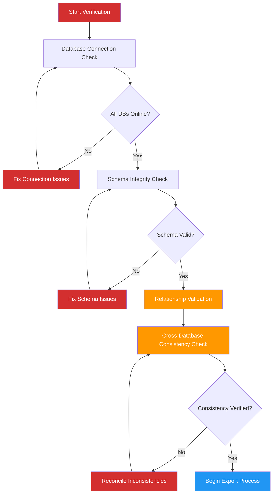

# Emergency Hybrid Knowledge Graph Export Protocol

**Version**: 1.0.0  
**Date**: 2025-04-06  
**Author**: Robin L. M. Cheung, MBA  
**Classification**: Critical Procedure / Hardware Transition

## Overview

This document outlines the emergency procedure for exporting the entire hybrid Knowledge Graph (hKG) to prepare for hardware transition. This protocol ensures data integrity, completeness, and successful reimport on the new system.

## Pre-Export Verification



### Connection Verification

```bash
# Neo4j connection verification
neo4j-admin verify-connectivity --database=neo4j --verbose

# Qdrant health check
curl -X GET http://localhost:6333/health

# PostgreSQL connection test
pg_isready -h localhost -p 5432 -d hkg_audit_db -U hkg_user
```

### Schema Verification

```bash
# Export and validate Neo4j schema
cypher-shell -u neo4j -p "$NEO4J_PASSWORD" \
"CALL apoc.meta.schema()" > /tmp/neo4j_schema.json

jsonschema -i /tmp/neo4j_schema.json /home/robin/CascadeProjects/robinpedia/config/schemas/neo4j_schema_validator.json

# Verify PostgreSQL schema
pg_dump -h localhost -U hkg_user -d hkg_audit_db --schema-only > /tmp/pg_schema.sql
```

### Relationship Count Validation

```bash
# Validate Neo4j relationship counts
cypher-shell -u neo4j -p "$NEO4J_PASSWORD" \
"MATCH ()-[r]->() RETURN type(r) as relType, count(r) as count" > /tmp/relationship_counts.txt

# Verify expected counts against baseline
python3 /home/robin/CascadeProjects/robinpedia/tools/verify_relationship_counts.py \
/tmp/relationship_counts.txt \
/home/robin/CascadeProjects/robinpedia/config/baselines/expected_relationships.json
```

## Export Process

### 1. Neo4j Export

```bash
#!/bin/bash
# Neo4j graph data export script

TIMESTAMP=$(date +%Y%m%d%H%M%S)
EXPORT_DIR="/home/robin/hkg_export/$TIMESTAMP/neo4j"
mkdir -p $EXPORT_DIR

# Create a consistent snapshot
neo4j-admin database dump neo4j --to=$EXPORT_DIR/neo4j_dump.dump

# Export as GraphML for portability
cypher-shell -u neo4j -p "$NEO4J_PASSWORD" \
"CALL apoc.export.graphml.all('$EXPORT_DIR/knowledge_graph.graphml', {useTypes:true, readLabels:true})"

# Export as JSON for easy inspection
cypher-shell -u neo4j -p "$NEO4J_PASSWORD" \
"CALL apoc.export.json.all('$EXPORT_DIR/knowledge_graph.json', {useTypes:true})"

# Create SHA-256 checksums
cd $EXPORT_DIR
sha256sum * > checksums.sha256
```

### 2. Qdrant Export

```python
# qdrant_export.py
import os
import json
import hashlib
import datetime
import qdrant_client
from qdrant_client.http import models

TIMESTAMP = datetime.datetime.now().strftime("%Y%m%d%H%M%S")
EXPORT_DIR = f"/home/robin/hkg_export/{TIMESTAMP}/qdrant"
os.makedirs(EXPORT_DIR, exist_ok=True)

client = qdrant_client.QdrantClient(host="localhost", port=6333)

# Get all collections
collections = client.get_collections().collections
collection_data = {}

for collection in collections:
    collection_name = collection.name
    
    # Get collection info
    collection_info = client.get_collection(collection_name)
    
    # Export vectors and payloads
    vectors = []
    
    # Scroll through all points in collection
    points = client.scroll(
        collection_name=collection_name,
        limit=100,
        with_payload=True,
        with_vectors=True,
    )
    
    while points[0]:
        for point in points[0]:
            vectors.append({
                "id": point.id,
                "vector": point.vector,
                "payload": point.payload
            })
        
        # Get next batch
        points = client.scroll(
            collection_name=collection_name,
            limit=100,
            with_payload=True,
            with_vectors=True,
            offset=points[1]
        )
    
    collection_data[collection_name] = {
        "config": collection_info.dict(),
        "vectors": vectors
    }

# Save to file
with open(f"{EXPORT_DIR}/qdrant_export.json", "w") as f:
    json.dump(collection_data, f, indent=2)

# Create checksum
with open(f"{EXPORT_DIR}/qdrant_export.json", "rb") as f:
    checksum = hashlib.sha256(f.read()).hexdigest()
    
with open(f"{EXPORT_DIR}/checksums.sha256", "w") as f:
    f.write(f"{checksum}  qdrant_export.json\n")
```

### 3. PostgreSQL Export

```bash
#!/bin/bash
# PostgreSQL export script

TIMESTAMP=$(date +%Y%m%d%H%M%S)
EXPORT_DIR="/home/robin/hkg_export/$TIMESTAMP/postgres"
mkdir -p $EXPORT_DIR

# Custom pg_dump format for full restore capability
pg_dump -h localhost -U hkg_user -d hkg_audit_db -F c > $EXPORT_DIR/hkg_audit_db.dump

# SQL format for inspection
pg_dump -h localhost -U hkg_user -d hkg_audit_db > $EXPORT_DIR/hkg_audit_db.sql

# CSV export of critical tables for alternative import
mkdir -p $EXPORT_DIR/csv
psql -h localhost -U hkg_user -d hkg_audit_db -c "\copy audit_log TO '$EXPORT_DIR/csv/audit_log.csv' WITH CSV HEADER"
psql -h localhost -U hkg_user -d hkg_audit_db -c "\copy project_status TO '$EXPORT_DIR/csv/project_status.csv' WITH CSV HEADER"
psql -h localhost -U hkg_user -d hkg_audit_db -c "\copy knowledge_entities TO '$EXPORT_DIR/csv/knowledge_entities.csv' WITH CSV HEADER"

# Create checksums
cd $EXPORT_DIR
sha256sum * csv/* > checksums.sha256
```

### 4. Markdown Documentation Snapshot

```bash
#!/bin/bash
# Markdown documentation export script

TIMESTAMP=$(date +%Y%m%d%H%M%S)
EXPORT_DIR="/home/robin/hkg_export/$TIMESTAMP/markdown"
mkdir -p $EXPORT_DIR

# Create a compressed archive of all markdown documentation
cd /home/robin/CascadeProjects
find . -name "*.md" | tar -czvf $EXPORT_DIR/all_documentation.tar.gz -T -

# Extract document metadata for indexing
find . -name "*.md" -exec sh -c 'echo "$(basename {}): $(head -5 {})"' \; > $EXPORT_DIR/document_index.txt

# Create a JSON index for easier search
python3 /home/robin/CascadeProjects/robinpedia/tools/generate_markdown_index.py \
  --source-dir=/home/robin/CascadeProjects \
  --output=$EXPORT_DIR/documentation_index.json

# Create checksums
cd $EXPORT_DIR
sha256sum * > checksums.sha256
```

## Comprehensive Package Creation

```bash
#!/bin/bash
# Create the final export package

TIMESTAMP=$(date +%Y%m%d%H%M%S)
EXPORT_BASE="/home/robin/hkg_export/$TIMESTAMP"
FINAL_PACKAGE="/home/robin/hkg_export/hkg_full_export_$TIMESTAMP.tar.gz"

# Create metadata file
cat > $EXPORT_BASE/metadata.json << EOF
{
  "export_timestamp": "$(date -Iseconds)",
  "export_version": "1.0.0",
  "exported_by": "Robin L. M. Cheung, MBA",
  "system_info": "$(uname -a)",
  "database_sizes": {
    "neo4j": "$(du -sh $EXPORT_BASE/neo4j | cut -f1)",
    "qdrant": "$(du -sh $EXPORT_BASE/qdrant | cut -f1)",
    "postgres": "$(du -sh $EXPORT_BASE/postgres | cut -f1)",
    "markdown": "$(du -sh $EXPORT_BASE/markdown | cut -f1)"
  },
  "entity_counts": {
    "neo4j_nodes": "$(cat $EXPORT_BASE/neo4j/stats.txt | grep 'nodes' | awk '{print $2}')",
    "neo4j_relationships": "$(cat $EXPORT_BASE/neo4j/stats.txt | grep 'relationships' | awk '{print $2}')",
    "postgres_audit_entries": "$(cat $EXPORT_BASE/postgres/csv/audit_log.csv | wc -l)",
    "qdrant_vectors": "$(cat $EXPORT_BASE/qdrant/stats.txt | grep 'vectors' | awk '{print $2}')"
  }
}
EOF

# Create emergency restore script
cat > $EXPORT_BASE/emergency_restore.sh << 'EOF'
#!/bin/bash
# Emergency Restore Script

set -e

TIMESTAMP=$(date +%Y%m%d%H%M%S)
LOG_FILE="restore_$TIMESTAMP.log"

echo "Starting emergency restore at $(date)" | tee -a $LOG_FILE

# Verify checksums
echo "Verifying checksums..." | tee -a $LOG_FILE
cd neo4j && sha256sum -c checksums.sha256 && cd ..
cd qdrant && sha256sum -c checksums.sha256 && cd ..
cd postgres && sha256sum -c checksums.sha256 && cd ..
cd markdown && sha256sum -c checksums.sha256 && cd ..

# Restore Neo4j
echo "Restoring Neo4j..." | tee -a $LOG_FILE
neo4j-admin database load neo4j --from=neo4j/neo4j_dump.dump --force

# Restore Qdrant
echo "Restoring Qdrant..." | tee -a $LOG_FILE
python3 restore_qdrant.py

# Restore PostgreSQL
echo "Restoring PostgreSQL..." | tee -a $LOG_FILE
pg_restore -h localhost -U hkg_user -d hkg_audit_db -c -C postgres/hkg_audit_db.dump

# Verify restore
echo "Verifying restore..." | tee -a $LOG_FILE
python3 verify_restore.py

echo "Restore completed at $(date)" | tee -a $LOG_FILE
EOF

chmod +x $EXPORT_BASE/emergency_restore.sh

# Create Python restore scripts
cat > $EXPORT_BASE/restore_qdrant.py << 'EOF'
import json
import qdrant_client
from qdrant_client.http import models

with open("qdrant/qdrant_export.json", "r") as f:
    export_data = json.load(f)

client = qdrant_client.QdrantClient(host="localhost", port=6333)

for collection_name, collection_data in export_data.items():
    # Check if collection exists
    try:
        client.get_collection(collection_name)
        print(f"Collection {collection_name} already exists. Recreating...")
        client.delete_collection(collection_name)
    except:
        pass
    
    # Create collection with original config
    config = collection_data["config"]
    client.create_collection(
        collection_name=collection_name,
        vectors_config=config["vectors_config"]
    )
    
    # Batch load vectors
    vectors = collection_data["vectors"]
    batch_size = 100
    
    for i in range(0, len(vectors), batch_size):
        batch = vectors[i:i+batch_size]
        points = [
            models.PointStruct(
                id=point["id"],
                vector=point["vector"],
                payload=point["payload"]
            )
            for point in batch
        ]
        
        client.upsert(
            collection_name=collection_name,
            points=points
        )
        
    print(f"Restored {len(vectors)} vectors to collection {collection_name}")
EOF

cat > $EXPORT_BASE/verify_restore.py << 'EOF'
import json
import subprocess
import re
import requests

def verify_neo4j():
    result = subprocess.run(
        ["cypher-shell", "-u", "neo4j", "-p", "$NEO4J_PASSWORD", 
         "MATCH (n) RETURN count(n) as nodeCount"],
        capture_output=True, text=True
    )
    
    node_count = re.search(r'nodeCount\s+\|\s+(\d+)', result.stdout)
    with open("neo4j/stats.txt", "r") as f:
        expected_count = re.search(r'nodes\s+(\d+)', f.read()).group(1)
    
    if node_count and int(node_count.group(1)) == int(expected_count):
        print("Neo4j verify: SUCCESS")
        return True
    else:
        print("Neo4j verify: FAILURE")
        return False

def verify_qdrant():
    with open("qdrant/qdrant_export.json", "r") as f:
        export_data = json.load(f)
    
    collections = requests.get("http://localhost:6333/collections").json()
    collection_names = [c["name"] for c in collections["result"]["collections"]]
    
    if set(export_data.keys()).issubset(set(collection_names)):
        print("Qdrant verify: SUCCESS")
        return True
    else:
        print("Qdrant verify: FAILURE")
        return False

def verify_postgres():
    result = subprocess.run(
        ["psql", "-h", "localhost", "-U", "hkg_user", "-d", "hkg_audit_db", 
         "-c", "SELECT COUNT(*) FROM audit_log"],
        capture_output=True, text=True
    )
    
    row_count = re.search(r'\s+(\d+)', result.stdout)
    
    with open("postgres/csv/audit_log.csv", "r") as f:
        expected_count = sum(1 for _ in f) - 1  # Subtract header
    
    if row_count and int(row_count.group(1)) == expected_count:
        print("PostgreSQL verify: SUCCESS")
        return True
    else:
        print("PostgreSQL verify: FAILURE")
        return False

if __name__ == "__main__":
    neo4j_ok = verify_neo4j()
    qdrant_ok = verify_qdrant()
    postgres_ok = verify_postgres()
    
    if neo4j_ok and qdrant_ok and postgres_ok:
        print("All databases successfully restored!")
        exit(0)
    else:
        print("Restore verification failed!")
        exit(1)
EOF

# Create the compressed archive
tar -czvf $FINAL_PACKAGE -C $(dirname $EXPORT_BASE) $(basename $EXPORT_BASE)

# Create checksum for the final package
sha256sum $FINAL_PACKAGE > ${FINAL_PACKAGE}.sha256

echo "Export complete: $FINAL_PACKAGE"
echo "SHA-256: $(cat ${FINAL_PACKAGE}.sha256)"
```

## Verification Process

### Pre-Transfer Verification

Prior to transferring the export package to the new hardware:

1. **Checksum Verification**
   ```bash
   sha256sum -c ${FINAL_PACKAGE}.sha256
   ```

2. **Package Integrity**
   ```bash
   tar -tvf $FINAL_PACKAGE | grep emergency_restore.sh
   ```

3. **Database Statistics Verification**
   ```bash
   python3 /home/robin/CascadeProjects/robinpedia/tools/verify_export_stats.py \
     --export-package=$FINAL_PACKAGE \
     --expected-stats=/home/robin/CascadeProjects/robinpedia/config/baselines/expected_db_stats.json
   ```

### Post-Transfer Verification

After transferring to the new hardware:

1. **Package Integrity**
   ```bash
   sha256sum -c hkg_full_export_*.tar.gz.sha256
   ```

2. **Test Restore**
   ```bash
   mkdir -p /tmp/hkg_restore_test
   tar -xzvf hkg_full_export_*.tar.gz -C /tmp/hkg_restore_test
   cd /tmp/hkg_restore_test/*
   ./emergency_restore.sh
   ```

3. **Application Integration Test**
   ```bash
   cd /path/to/robinpedia
   python3 ./tests/integration/hkg_connection_test.py
   ```

## Transfer Methods

### Secure Transfer Options

1. **Direct Network Transfer** (if both systems are on same network)
   ```bash
   rsync -avz --progress $FINAL_PACKAGE username@new-machine:/destination/path/
   ```

2. **Cloud Storage Transfer** (using encrypted upload)
   ```bash
   # Encrypt the package
   gpg --output ${FINAL_PACKAGE}.gpg --encrypt --recipient robin@example.com $FINAL_PACKAGE
   
   # Upload to cloud storage
   rclone copy ${FINAL_PACKAGE}.gpg remote:hkg-backup/
   
   # On new machine
   rclone copy remote:hkg-backup/${FINAL_PACKAGE##*/}.gpg /local/path/
   
   # Decrypt
   gpg --output $FINAL_PACKAGE --decrypt ${FINAL_PACKAGE}.gpg
   ```

3. **Physical Media Transfer** (with verification)
   ```bash
   # Write to external media
   dd if=$FINAL_PACKAGE of=/dev/sdX bs=4M status=progress
   
   # On new machine, verify before reading
   dd if=/dev/sdX | sha256sum -c ${FINAL_PACKAGE}.sha256
   dd if=/dev/sdX of=/path/on/new/machine/$FINAL_PACKAGE bs=4M
   ```

## Emergency Recovery SOP

In case of failure during the hardware transition:

1. Identify the last successful state from backup checksums
2. Restore using the emergency_restore.sh script
3. Verify data integrity using the verify_restore.py script
4. If inconsistencies are detected, use the CSV exports for manual data comparison
5. Document all issues in the audit log

## Known Limitations

1. Active transactions during export may not be captured
2. External references (URLs, file paths) may need adjustment on new hardware
3. Hardware-specific optimizations will need reconfiguration
4. User permissions and access credentials will need separate transfer

## Critical Success Factors

1. All database checksums match expected values
2. Entity and relationship counts match pre-export verification
3. Application integration tests pass after restore
4. No data loss or corruption during transfer
5. Full system functionality on new hardware

## Copyright

Copyright (C) 2025 Robin L. M. Cheung, MBA. All rights reserved.
