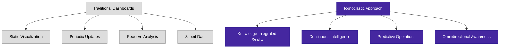
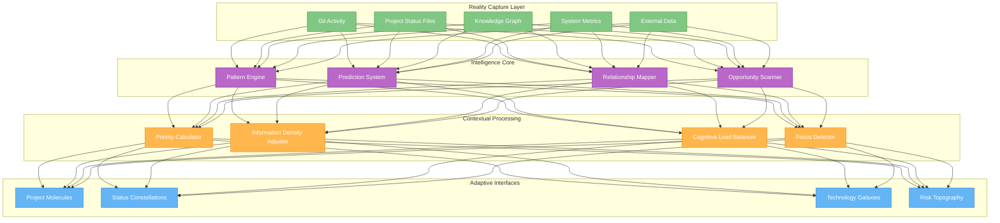

# Iconoclastic Dashboard Architecture

**Version**: 1.0.0  
**Date**: 2025-04-06  
**Author**: Robin L. M. Cheung, MBA  
**Classification**: Visionary Architecture / Conceptual Framework

## Breaking Traditional Paradigms

The concept outlined here represents a fundamental re-imagining of project dashboards, designed specifically for our unique position as a high-capability duo with enterprise-level aspirations but without enterprise-level constraints.

## Core Principles

1. **Quantum Knowledge Integration**
   - Dashboard _is_ the knowledge graph, not just a view into it
   - Direct manipulation of project data through visualization
   - No separation between representation and reality

2. **Self-Evolving Interface**
   - Dashboard layout and components evolve with usage patterns
   - Interface elements strengthen or fade based on value contribution
   - Contextual awareness adjusts information density to cognitive load

3. **Thought-Speed Operations**
   - Eliminate traditional "click and wait" interactions
   - Predictive modeling of next information needs
   - Pre-rendered alternative views based on probable navigation paths

4. **Cross-Project Intelligence**
   - Autonomous pattern recognition across disparate projects
   - Automatic identification of reusable components and approaches
   - Active suggestions for cross-pollination opportunities

## Architectural Visualization

## Iconoclastic Features

### 1. Project Molecules

Rather than traditional charts and tables, represent projects as molecular structures:

- **Atoms**: Individual components/features
- **Bonds**: Dependencies and relationships
- **Energy States**: Completion levels
- **Molecular Motion**: Development activity
- **Isotopes**: Variants and branches

These project molecules can be:
- Examined at different levels of detail
- Compared and combined with other molecules
- Decomposed into constituent parts
- Projected forward in time to show probable evolution

### 2. Status Constellations

Reimagine status tracking as celestial constellations:

- **Stars**: Key milestones and achievements
- **Brightness**: Priority and importance
- **Proximity**: Related work items
- **Constellations**: Related groups of work
- **Celestial Motion**: Project progression through time

This allows for:
- Intuitive pattern recognition
- Immediate identification of critical paths
- Natural grouping of related work
- Temporal history visualization

### 3. Technology Galaxies

Visualize technology stacks as galactic structures:

- **Star Systems**: Major technologies
- **Planets**: Implementation instances
- **Orbital Paths**: Usage patterns
- **Gravitational Effects**: Dependencies
- **Galactic Movement**: Evolution of technology usage

Benefits include:
- Cross-project technology visualization
- Identification of technology clustering
- Recognition of technological gaps
- Visualization of technology life cycles

### 4. Risk Topography

Represent project risks as dynamic topographic maps:

- **Mountains**: Critical blockers
- **Valleys**: Safe paths forward
- **Rivers**: Resource flows
- **Weather Patterns**: Changing conditions
- **Erosion**: Technical debt

This provides:
- Intuitive understanding of risk landscape
- Path planning through complex challenges
- Early warning systems for emerging problems
- Resource allocation guidance

## Technical Implementation

The implementation of this iconoclastic approach leverages our unique advantages:

1. **Flutter-Native Implementation**
   - Direct hKG integration
   - Cellular architecture mirroring mental models
   - Hardware-accelerated dynamic visualizations
   - Cross-platform with identical experience

2. **Integrated LLM Coordinator**
   - Real-time pattern recognition
   - Natural language interaction
   - Proactive insight generation
   - Contextual awareness across projects

3. **Quantum-Inspired State Management**
   - Superposition of alternative visualization states
   - Entangled data representations
   - Observer-dependent information presentation
   - Probabilistic prediction models

## Advantages Over Traditional Approaches

1. **Transcends Artificial Boundaries**
   - No arbitrary division between data, visualization, and action
   - Seamless flow between different information contexts
   - Natural representation of complex relationships

2. **Scales with Cognitive Capacity**
   - Interface complexity adjusts to match user's cognitive state
   - Multiple simultaneous levels of information density
   - Progressive disclosure based on attention patterns

3. **Time Compression**
   - Future states represented alongside current state
   - Historical context always available
   - Pattern recognition across temporal dimensions

4. **Zero-Friction Interaction**
   - Anticipatory interface adjustments
   - Context-sensitive control mechanisms
   - Adaptive information prioritization

## Implementation Roadmap

### Phase 1: Foundation (1-2 months)
- Develop core Flutter visualization engine
- Implement direct hKG integration
- Create base project molecule visualization
- Deploy resident LLM coordinator integration

### Phase 2: Evolution (2-4 months)
- Implement adaptive interface mechanisms
- Develop technology galaxy representation
- Create predictive capability for project trajectories
- Deploy risk topography visualization

### Phase 3: Transcendence (4-6 months)
- Implement self-evolving interface capabilities
- Deploy cross-project intelligence
- Create temporal projection system
- Integrate with all existing systems

## Philosophical Foundation

This iconoclastic approach is built on the understanding that:

1. **Information is Reality**
   - The representation _is_ the thing represented
   - Changes to visualization directly affect the underlying reality
   - No artificial separation between "dashboard" and "system"

2. **Intelligence is Distributed**
   - Cognitive work shared between human, LLM, and interface
   - Each component handles appropriate aspects of intelligence
   - Seamless flow of insight generation across boundaries

3. **Time is Fluid**
   - Past, present, and future states exist simultaneously
   - Navigation through temporal dimensions is as natural as spatial
   - Historical context informs future projections

## Conclusion

This iconoclastic dashboard concept represents a fundamental break from traditional approaches, leveraging our unique position as a high-capability duo with the freedom to reimagine what's possible. By treating the dashboard as a direct extension of our cognitive capabilities rather than a separate tool, we create a system that grows with us, thinks with us, and achieves with us.

The result will be a dashboard experience that doesn't just display our projects but actively participates in their creation, evolution, and optimization - something truly impossible in larger, more constrained organizational environments.

## Copyright

Copyright (C) 2025 Robin L. M. Cheung, MBA. All rights reserved.
