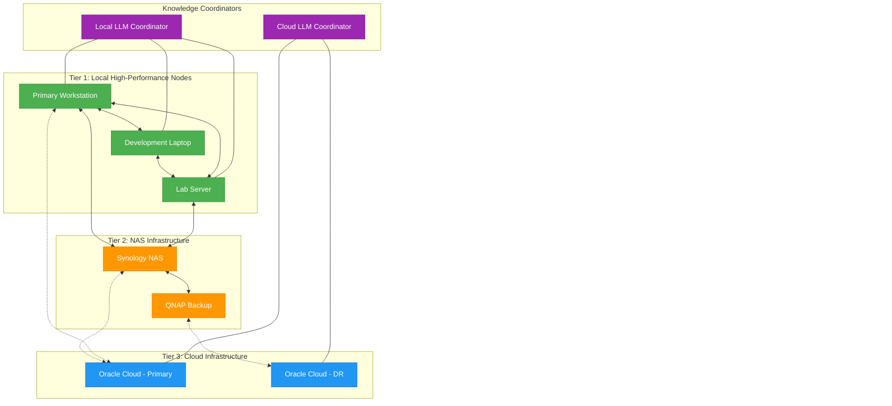
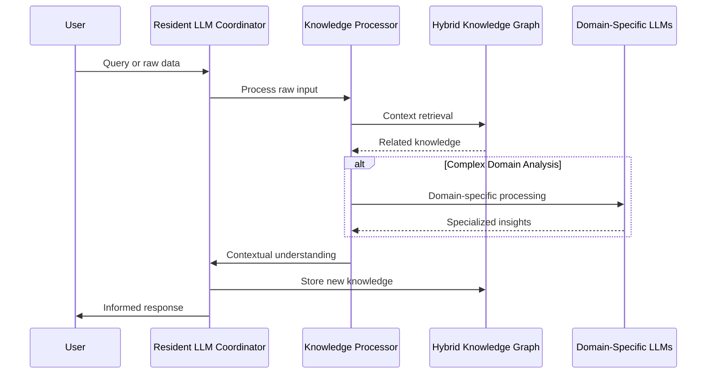
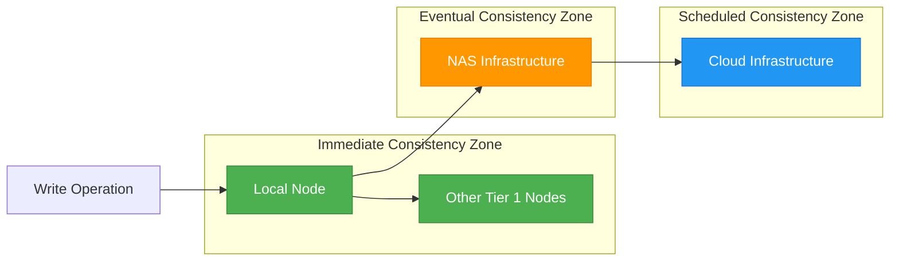
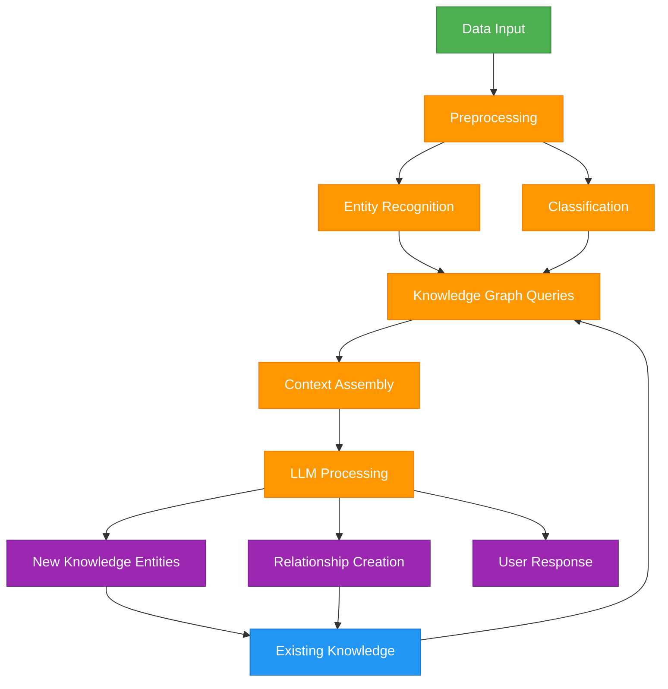

# Tiered Hybrid Knowledge Graph Architecture

**Version**: 1.0.0  
**Date**: 2025-04-06  
**Author**: Robin L. M. Cheung, MBA  
**Classification**: System Architecture / Infrastructure

## Tiered Distributed Knowledge Framework

This architecture establishes a tiered approach to the hybrid Knowledge Graph (hKG) that maintains full truth consistency across heterogeneous infrastructure while optimizing for access patterns and resource constraints.



## Tier Characteristics

### Tier 1: Local High-Performance Nodes

Local nodes function as primary interaction points with the hKG, offering:

- **High-Performance Access**: Sub-10ms query response times
- **Full Write Capabilities**: Direct mutation of all knowledge elements
- **Complete Index Availability**: All indices maintained locally
- **Resident LLM Integration**: Direct access to local LLM coordinators
- **Offline Operation**: Full functionality without network connectivity
- **Examples**: Primary workstation, development laptop, lab server

#### Synchronization Profile
- **Intra-Tier Sync**: Real-time, continuous bidirectional
- **Inter-Tier Sync**: Near real-time push to Tier 2, scheduled or on-demand pull from Tier 2

### Tier 2: Network-Attached Storage Infrastructure

NAS nodes serve as reliable intermediate persistence layer:

- **Moderate Performance**: 10-50ms query response times
- **Full Write Capabilities**: All mutation operations supported
- **Complete Index Availability**: All indices maintained
- **Batched Processing**: Optimized for throughput over latency
- **Local Network Bound**: Accessible within trusted networks
- **Examples**: Synology NAS, QNAP backup systems

#### Synchronization Profile
- **Intra-Tier Sync**: Scheduled bidirectional (1-5 minute intervals)
- **Inter-Tier Sync**: Push to Tier 3 on schedule or threshold (15-60 minute intervals)
- **Bandwidth Optimization**: Delta-based transfers with compression

### Tier 3: Cloud Infrastructure

Cloud nodes provide archival, disaster recovery, and remote access:

- **Variable Performance**: 50-500ms query response times (dependency on connection)
- **Full Write Capabilities**: All operations supported with conflict resolution
- **Optimized Index Availability**: Primary indices only, specialized indices on-demand
- **VPN Access Required**: Secured through encrypted tunnels
- **Metered Bandwidth Aware**: Transfer optimization for cost control
- **Examples**: Oracle Cloud Infrastructure nodes, multi-region deployment

#### Synchronization Profile
- **Intra-Tier Sync**: Scheduled bidirectional with consensus verification (hourly)
- **Inter-Tier Sync**: Pull from Tier 2 on schedule (hourly to daily)
- **Bandwidth Conservation**: Highly compressed deltas with optional on-demand full syncs

## Knowledge Coordinators

Resident LLM coordinators serve as intelligent interfaces to the hKG:



### Coordinator Functions

1. **Knowledge Ingestion**
   - Raw data classification and structuring
   - Entity extraction and relationship mapping
   - Automatic tagging and categorization
   - Confidence scoring for inferred knowledge

2. **Contextual Processing**
   - Cross-reference with existing knowledge
   - Contradiction detection and resolution
   - Uncertainty quantification
   - Knowledge graph completion

3. **Information Synthesis**
   - Generation of high-level insights
   - Pattern recognition across domains
   - Trend identification and projection
   - Anomaly detection in knowledge patterns

4. **Adaptive Knowledge Distribution**
   - Prioritization of critical information for syncing
   - Bandwidth-aware transmission scheduling
   - Access pattern optimization
   - Predictive pre-loading of likely needed information

### Coordinator Implementation

**Local Coordinator**:
- Runs on Tier 1 nodes with direct filesystem access
- Uses lightweight quantized models optimized for local inference
- Maintains persistent state for context awareness
- Processes all local interactions with hKG

**Cloud Coordinator**:
- Runs on more powerful Oracle Cloud infrastructure
- Leverages larger, more capable models
- Handles batch processing of accumulated data
- Performs deeper analysis for long-term patterns

## Any-Node Access Principle

The architecture adheres to the "any-node access" principle:

1. **Universal Truth Representation**
   - Every node contains a complete logical view of the knowledge graph
   - Physical storage may be optimized per tier
   - Seamless logical addressing across the entire graph

2. **Access Path Optimization**
   - Automatic routing to optimal data source
   - Transparent read-through caching
   - Path cost awareness (latency, bandwidth, monetary cost)

3. **Query Decomposition**
   - Complex queries split to execute optimal components on each tier
   - Results aggregation across tiers
   - Response time guarantees with progressive refinement

4. **Connectivity-Aware Operation**
   - Graceful degradation with connection loss
   - Optimistic local operations with later reconciliation
   - Explicit consistency level selection per operation

## Sync and Consistency Model



### Consistency Levels

1. **Immediate Consistency**
   - Applies to operations within Tier 1
   - Synchronous replication with consensus
   - Transaction guarantees across local nodes
   - Used for critical operational data

2. **Eventual Consistency**
   - Applied between Tier 1 and Tier 2
   - Asynchronous replication with conflict resolution
   - Background reconciliation
   - Used for most knowledge entities

3. **Scheduled Consistency**
   - Applied between Tier 2 and Tier 3
   - Batch-oriented with explicit sync windows
   - Bandwidth and cost optimized
   - Used for archival and disaster recovery

### Vector Clock Synchronization

Each knowledge entity maintains a vector clock:
```json
{
  "entity_id": "concept:distributed-systems:2025-04-01",
  "vector_clock": {
    "tier1-workstation": 42,
    "tier1-laptop": 38,
    "tier2-nas": 30,
    "tier3-oracle-primary": 25
  },
  "content": "..."
}
```

This enables:
- Precise tracking of entity evolution
- Deterministic conflict resolution
- Causal consistency guarantees
- Partial order reconstruction

## Bandwidth-Optimized Transfer Protocol

### Tier-Specific Optimization

1. **Tier 1 ↔ Tier 1**
   - Full-fidelity, immediate synchronization
   - Direct memory-mapped transfers when possible
   - Zero-copy operations for large datasets

2. **Tier 1 ↔ Tier 2**
   - Delta-based transfers
   - Background synchronization with priority queues
   - Adaptive batch sizing based on network conditions

3. **Tier 2 ↔ Tier 3**
   - Highly compressed deltas
   - Content-aware chunking
   - Rate-limited transfers respecting bandwidth constraints
   - Diffable binary formats for minimal transfer size

### Oracle Cloud Optimization

For metered Oracle Cloud Infrastructure:

1. **Cost-Aware Sync Scheduling**
   - Sync during lowest cost periods
   - Bandwidth quota allocation with carryover
   - Prioritization matrix for critical vs. non-critical data

2. **VPN Tunnel Optimization**
   - Keep-alive control to minimize connection overhead
   - Session persistence for amortized authentication cost
   - Multiplex multiple logical connections

3. **Deduplication Pipeline**
   - Global deduplication across all knowledge entities
   - Rolling hash content-defined chunking
   - Server-side similarity detection
   - Compressed reference lists instead of content

## Implementation Strategy

### Immediate (Hardware Transition)

1. **Emergency Export Protocol Implementation**
   - Complete the export protocol from `EMERGENCY_HKG_EXPORT.md`
   - Ensure hardware-independent format for all exports
   - Verify imports on new hardware

2. **Tier 1 Node Configuration**
   - Setup bidirectional sync between workstation and laptop
   - Implement vector clock consistency tracking
   - Deploy local LLM coordinator

### Near-Term (1-2 Weeks)

1. **NAS Integration**
   - Configure Synology and QNAP for hKG storage
   - Implement delta-based synchronization
   - Establish automated backup schedules

2. **Consensus Protocol Deployment**
   - Implement CRDT data structures for key entities
   - Deploy Raft consensus for configuration management
   - Test failure scenarios and recovery

### Medium-Term (2-4 Weeks)

1. **Oracle Cloud Deployment**
   - Configure OCI instances for hKG nodes
   - Establish VPN tunnels with optimal settings
   - Deploy cloud-based LLM coordinator

2. **Bandwidth Optimization**
   - Implement adaptive compression
   - Deploy traffic shaping rules
   - Configure metered awareness

### Long-Term (1-3 Months)

1. **Full Multi-Tier Query Capability**
   - Implement transparent query routing
   - Deploy cross-tier query decomposition
   - Establish progressive query responses

2. **Enhanced LLM Coordination**
   - Deploy specialized domain models
   - Implement cross-domain synthesis
   - Establish knowledge discovery pipelines

## Metrics and Monitoring

### Performance Metrics

1. **Synchronization Latency**
   - Tier 1 ↔ Tier 1: Target < 1 second
   - Tier 1 ↔ Tier 2: Target < 5 minutes
   - Tier 2 ↔ Tier 3: Target < 1 hour

2. **Query Performance**
   - Tier 1: p95 < 50ms
   - Tier 2: p95 < 200ms
   - Tier 3: p95 < 1s

3. **Consistency Metrics**
   - Version divergence counts
   - Conflict resolution frequency
   - Entity staleness by tier

### Resource Utilization

1. **Bandwidth Consumption**
   - Tier 1 ↔ Tier 2: Target < 50GB/month
   - Tier 2 ↔ Tier 3: Target < 10GB/month

2. **Storage Efficiency**
   - Deduplication ratio: Target > 5:1
   - Compression ratio: Target > 3:1
   - Storage overhead per entity: Target < 15%

3. **Computational Load**
   - LLM coordinator CPU utilization
   - Graph traversal performance
   - Index maintenance overhead

## Resident LLM Coordinator Architecture



### Resident LLM Functions

1. **Incoming Data Processing**
   - Natural language understanding
   - Structured data parsing
   - Multi-modal content analysis
   - Intent recognition

2. **Knowledge Graph Operations**
   - Entity extraction and alignment
   - Relationship inference
   - Consistency validation
   - Knowledge gap identification

3. **Information Synthesis**
   - Pattern recognition across domains
   - Insight generation from correlations
   - Predictive analysis based on historical data
   - Confidence-scored hypotheses

4. **User Interaction**
   - Context-aware responses
   - Proactive knowledge suggestions
   - Explanation of knowledge relationships
   - Uncertainty communication

## Hardware Transition Checklist

1. **Source System Preparation**:
   - [ ] Complete Emergency Export Protocol
   - [ ] Verify data integrity across all tiers
   - [ ] Document current sync state

2. **Target System Configuration**:
   - [ ] Configure all database environments
   - [ ] Set up network topology matching architecture
   - [ ] Prepare resident LLM coordinator

3. **Transfer Operations**:
   - [ ] Execute data migration per tier
   - [ ] Verify consistency post-transfer
   - [ ] Test node accessibility and operations

4. **Validation Suite**:
   - [ ] Run comprehensive access tests from all tiers
   - [ ] Verify bidirectional synchronization
   - [ ] Test resident LLM functionality
   - [ ] Measure performance against baselines

## Copyright

Copyright (C) 2025 Robin L. M. Cheung, MBA. All rights reserved.
