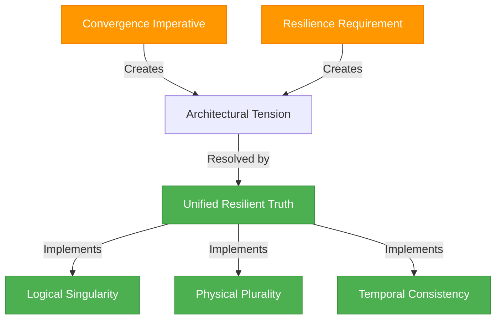
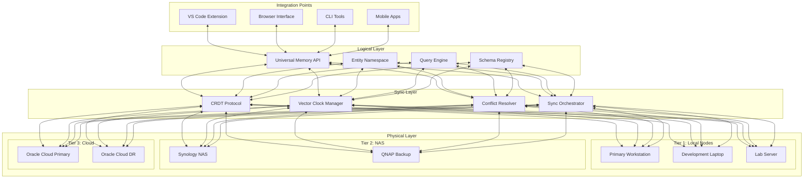

# Unified Resilient Truth: Architectural Paradox Resolution

**Version**: 1.0.0  
**Date**: 2025-04-06  
**Author**: Robin L. M. Cheung, MBA  
**Classification**: Architectural Principle / Implementation Strategy

## The Architectural Paradox

Our architecture faces a fundamental tension:

1. **Convergence Imperative**: All systems must rely on a single source of truth (the hybrid Knowledge Graph) to prevent information fragmentation, duplication, and inconsistency.

2. **Resilience Requirement**: As dependence on this single source increases, the criticality of eliminating single points of failure increases proportionally.

This document outlines our architectural approach to resolving this paradox.

## Resolution Strategy: Unified Resilient Truth

Our approach resolves this paradox through three key architectural principles:

### 1. Logical Singularity

The hKG presents as a **single logical entity** to all systems, despite its distributed physical implementation:

- **Unified API Layer**: All interactions occur through a consistent API regardless of entry point
- **Global Namespace**: Entities maintain consistent identifiers across all nodes
- **Schema Coherence**: Data models remain uniform throughout the system
- **Query Consistency**: Identical queries produce consistent results (within consistency bounds)
- **Memory Integration**: All memory systems (including Windsurf, VS Code, etc.) interact with the same logical knowledge graph

### 2. Physical Plurality

While logically singular, the hKG is **physically distributed** across multiple independent nodes:

- **Tiered Persistence**: Implementation across local nodes, NAS, and cloud infrastructure
- **No Master Node**: CRDT-based peer synchronization eliminates dependency on any single node
- **Redundant Storage**: Critical information replicated across multiple physical locations
- **Geographic Distribution**: Cloud nodes distributed across different regions
- **Media Diversity**: Storage across different media types (SSD, HDD, tape backup)
- **Independent Recovery**: Any node can rebuild completely from peer information

### 3. Temporal Consistency

The system maintains **causal consistency** across distributed components:

- **Vector Clocks**: Track entity evolution across distributed nodes
- **Conflict Resolution**: Deterministic resolution of concurrent modifications
- **Progressive Synchronization**: Immediate consistency within tiers, eventual consistency between tiers
- **Operation Journaling**: Complete history of modifications for audit and recovery
- **Versioned Entities**: Temporal navigation through entity history
- **Sync Status Awareness**: Systems always aware of consistency guarantees for data they access

## Implementation Details

### Memory System Integration

To address the specific issue of memory fragmentation between environments:

1. **Universal Memory Connector**:
   - Standardized API for memory creation, retrieval, and modification
   - Implementation variants for each environment (VS Code, browser, etc.)
   - Transparent routing to hKG backend

2. **Cross-Context Memory Synchronization**:
   - Memories created in any context (browser, VS Code) automatically propagate to hKG
   - Environment-specific metadata maintained but encapsulated
   - Bidirectional sync ensures consistency across contexts

3. **Memory Consistency Protocol**:
   - Push-on-create: New memories immediately pushed to hKG
   - Pull-on-access: Environment checks for updates before memory access
   - Periodic background sync for complete consistency

### Dashboard Integration

The actionable dashboard becomes a primary interface to this unified resilient truth:

1. **Truth Visualization + Manipulation**:
   - Direct visualization of entity relationships and status
   - Integrated manipulation capabilities for knowledge modification
   - Real-time feedback on sync status and consistency guarantees

2. **Resilience Monitoring**:
   - Continuous verification of node health and replication status
   - Early warning system for potential resilience issues
   - Automatic intervention for common resilience threats

3. **Reconciliation Interface**:
   - Tools for manual resolution of complex conflicts
   - Visualization of divergent information across nodes
   - Guided reconciliation workflows for maintaining consistency

## Technical Architecture

## Specific Solutions for Current Issues

### Windsurf Memory to hKG Integration

1. **Immediate Implementation**:
   - Create REST API endpoint in hKG service for memory operations
   - Develop browser extension to intercept Windsurf memory operations
   - Transform and forward to hKG API
   - Deploy on all browsers/environments

2. **Long-term Solution**:
   - Work with Windsurf team to create official plugin API
   - Develop native hKG connector plugin
   - Contribute back to Windsurf ecosystem

### VS Code Memory Access

1. **VS Code Extension**:
   - Develop hKG connector extension for VS Code
   - Implement memory API compatible with Roo-Coder interaction model
   - Ensure seamless memory access across coding sessions

2. **Universal Memory Protocol**:
   - Standardize memory access patterns across all tools
   - Create adapter layers for environment-specific implementations
   - Maintain consistent memory semantics regardless of context

## Success Metrics

The effectiveness of our unified resilient truth architecture will be measured by:

1. **Convergence Index**:
   - Percentage of knowledge accessible from any entry point
   - Target: >99.9%

2. **Resilience Factor**:
   - Number of independent node failures system can sustain
   - Target: N-2 (system remains operational with two failed nodes)

3. **Consistency Latency**:
   - Time required for changes to propagate across tiers
   - Target: <5s within Tier 1, <5min to Tier 2, <1hr to Tier 3

4. **Recovery Efficiency**:
   - Time to rebuild a failed node from peer information
   - Target: <1hr for Tier 1, <4hr for Tier 2, <24hr for Tier 3

## Conclusion

The unified resilient truth architecture resolves the fundamental paradox of needing both centralization and distribution by separating logical and physical aspects of the system. By presenting as a single, consistent entity while being physically distributed and temporally coherent, the hKG achieves both the benefits of a single source of truth and the resilience of a distributed system.

This architectural approach allows us to increasingly depend on the hKG as the authoritative source for all knowledge across our projects while ensuring that this increasing dependence does not create vulnerability through single points of failure.

## Copyright

Copyright (C) 2025 Robin L. M. Cheung, MBA. All rights reserved.
