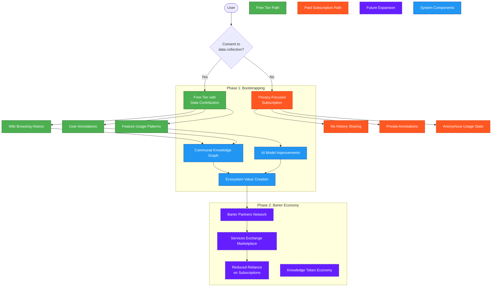
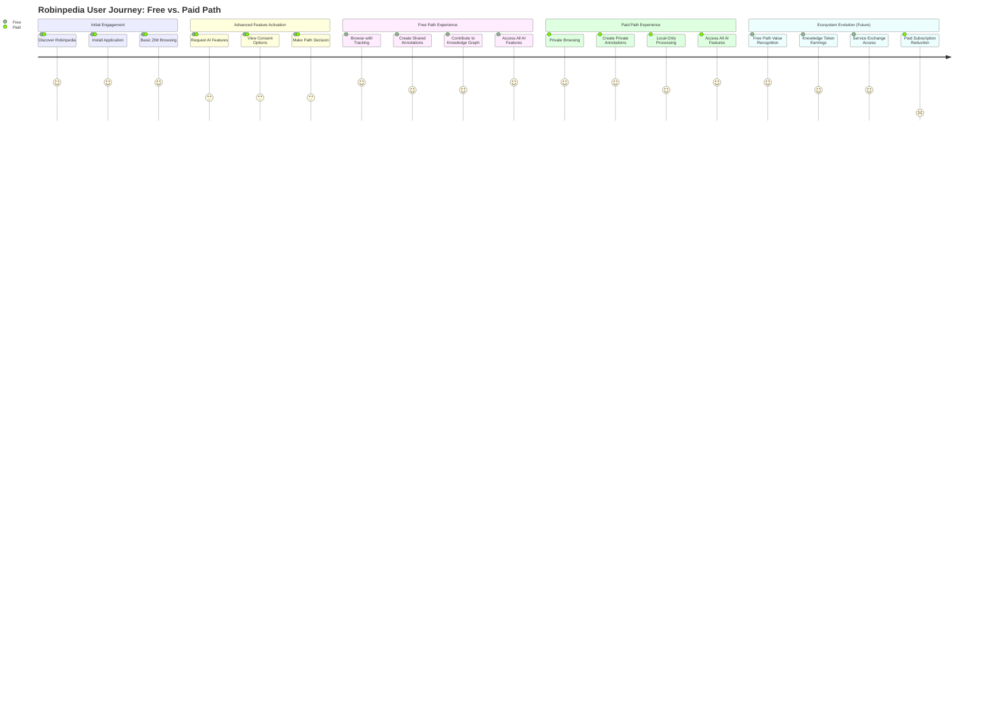
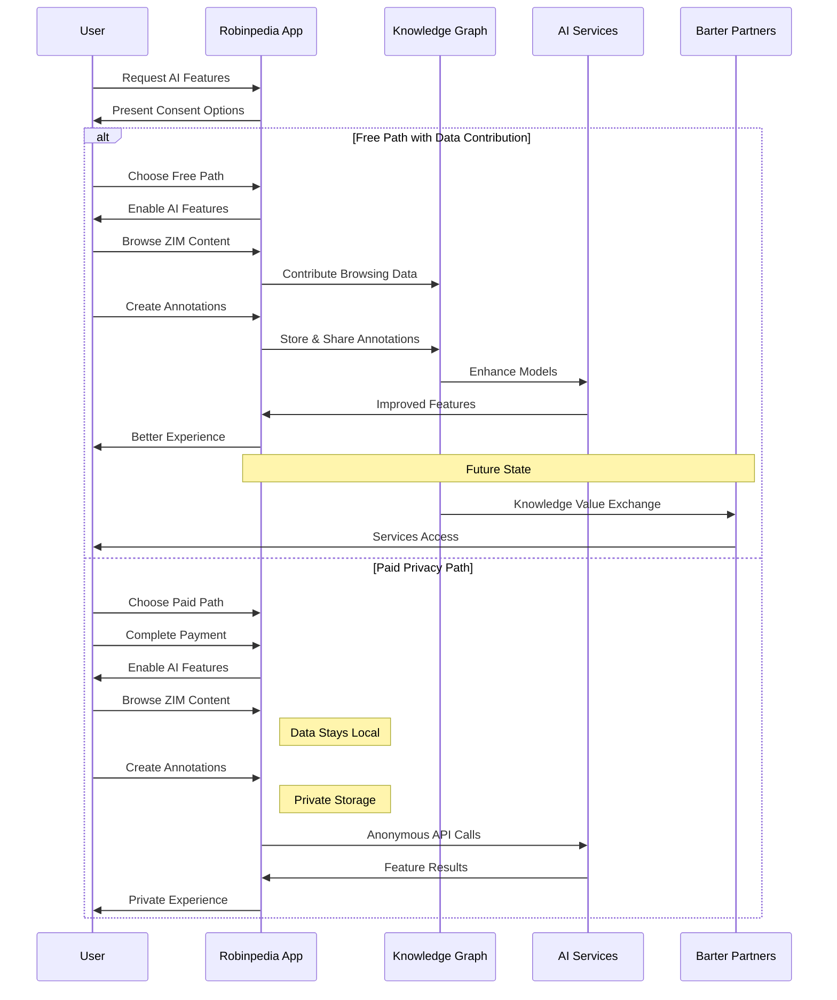

# AI Features Monetization Flow Diagram
*Copyright (C) 2025 Robin L. M. Cheung, MBA. All rights reserved.*

## Knowledge Barter System Evolution

## User Journey Map

## Data Flow in Barter System

## Metrics Dashboard Concept

The following metrics will be tracked to measure the success of our dual-path monetization strategy:

### Free Path Metrics
- Opt-in conversion rate (% of users choosing free path)
- Data contribution volume (articles viewed, annotations created)
- Knowledge graph enrichment metrics
- Feature usage frequency
- User satisfaction scores

### Paid Path Metrics
- Subscription conversion rate
- Monthly recurring revenue
- Customer lifetime value
- Churn rate
- Feature usage patterns
- Price sensitivity analysis

### Ecosystem Health Metrics
- Total active users (both paths)
- Knowledge graph coverage and quality
- Partner network growth rate
- Barter transaction volume (future)
- Balance between paid and free users
- Development cost coverage ratio

## Implementation Roadmap

| Phase | Milestone | Timeline | Status |
|-------|-----------|----------|--------|
| 1 | Consent management system | Q2 2025 | Planning |
| 1 | CLiP integration with flags | Q2 2025 | Research |
| 1 | Subscription payment system | Q3 2025 | Not started |
| 1 | Knowledge contribution tracking | Q3 2025 | Not started |
| 2 | Partner network development | Q4 2025 | Not started |
| 2 | Barter exchange protocol | Q4 2025 | Not started |
| 2 | Value attribution system | Q1 2026 | Not started |
| 2 | Token economy foundations | Q1 2026 | Not started |
