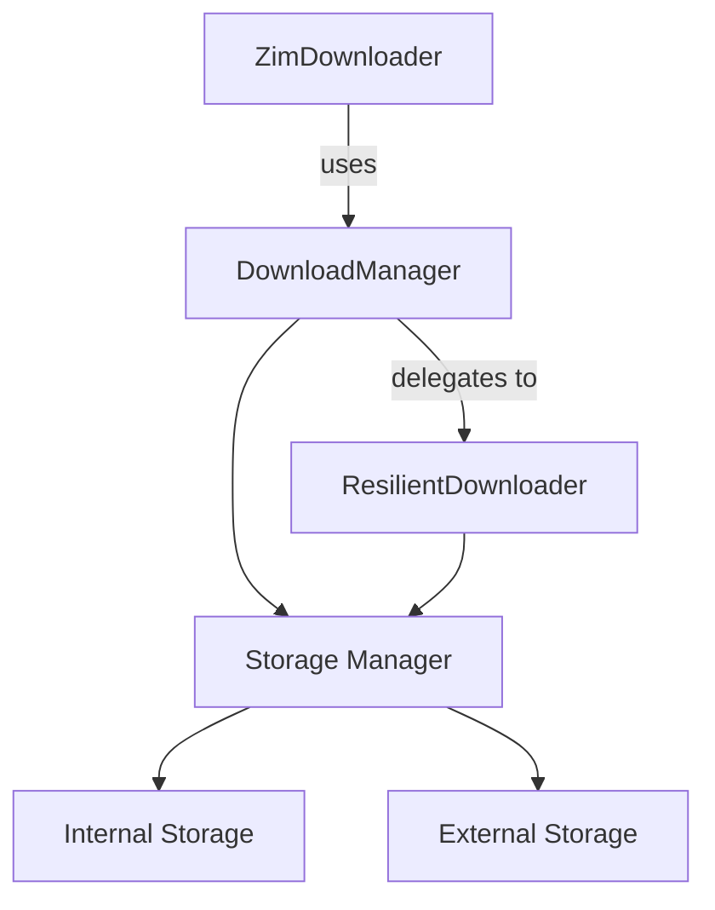

# Download System Architecture

## Current Issues

1. Fragmented Implementation
   - Three separate download implementations with overlapping functionality
   - No clear separation of concerns
   - Duplicated code for basic operations

2. Missing Features
   - ZimDownloader lacks resume capability
   - ResilientDownloader missing hash verification
   - Inconsistent progress reporting
   - No unified storage management

## Proposed Architecture

### Component Responsibilities

1. ZimDownloader
   - ZIM file metadata management
   - Mirror selection
   - File listing and search
   - Delegates actual downloads to DownloadManager

2. DownloadManager
   - Queue management
   - State persistence
   - Overall download coordination
   - Storage space management
   - Delegates actual download operations to ResilientDownloader

3. ResilientDownloader
   - Single file download handling
   - Resume capability
   - Chunk management
   - Progress tracking
   - Error handling
   - Integrity verification

4. Storage Manager (To Be Created)
   - Storage location management
   - Space availability checking
   - Temporary file cleanup
   - Path resolution

## Implementation Plan

### Phase 1: Core Infrastructure
1. Create StorageManager
   - [ ] Storage location configuration
   - [ ] Space management
   - [ ] Cleanup policies

2. Enhance ResilientDownloader
   - [ ] Implement hash verification
   - [ ] Add retry mechanism
   - [ ] Improve error handling
   - [ ] Add download speed calculation
   - [ ] Add time remaining estimation

3. Refactor DownloadManager
   - [ ] Use ResilientDownloader for downloads
   - [ ] Improve queue management
   - [ ] Add priority system
   - [ ] Enhance state persistence

### Phase 2: ZIM Integration
1. Update ZimDownloader
   - [ ] Remove direct download code
   - [ ] Integrate with DownloadManager
   - [ ] Add mirror failover
   - [ ] Improve progress reporting

2. Add ZIM-specific Features
   - [ ] Metadata verification
   - [ ] Index pre-download
   - [ ] Partial content preview

## Success Criteria

1. Downloads must:
   - Resume after interruption
   - Handle network issues gracefully
   - Report accurate progress
   - Verify file integrity
   - Manage storage efficiently

2. User Experience:
   - Clear progress indication
   - Accurate time estimates
   - Proper error messages
   - Storage warnings
   - Download prioritization

## Migration Strategy

1. Create new implementations alongside existing code
2. Gradually migrate features
3. Test thoroughly
4. Switch over component by component
5. Remove deprecated implementations

## Immediate Actions

1. Stop work on knowledge graph features
2. Focus on completing ZIM download and reading functionality
3. Follow Phase 1 implementation plan
4. Add proper test coverage
5. Document APIs thoroughly

Remember: Basic ZIM reading functionality must be solid before moving to advanced features.