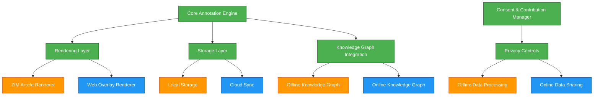
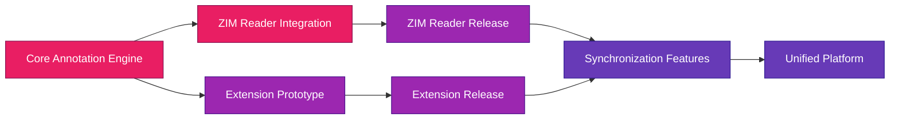

# Dual Deployment Strategy: ZIM Reader & Chrome Extension
*Copyright (C) 2025 Robin L. M. Cheung, MBA. All rights reserved.*

## Meeting Users Where They Are

Robinpedia will implement a dual deployment strategy to bridge between two key user communities:

1. **Offline/Prepper Community**: Self-contained ZIM reader application for offline knowledge access
2. **Online Mainstream Users**: Chrome extension that adds annotation capabilities to live Wikipedia browsing

This approach recognizes that while the offline capability is essential for resilience, most users engage with Wikipedia content through their web browsers daily.

## Shared Architecture Components

## Technical Implementation Considerations

### Core Components (Shared)

1. **Annotation Engine**
   - Written in Dart/Flutter for ZIM reader
   - Compiled to JavaScript for Chrome extension
   - Shared annotation data model and rendering logic

2. **Knowledge Graph Integration**
   - Same semantic extraction capabilities
   - Identical contribution mechanisms
   - Unified consent management

3. **Privacy & Contribution System**
   - Identical dual-path options (free with contribution or subscription)
   - Same underlying consent management
   - Unified fulfillment recognition systems

### ZIM Reader Specific

1. **Offline-First Architecture**
   - Full content availability without connectivity
   - Local-first storage with optional sync
   - Self-contained knowledge graph

2. **Resilience Features**
   - Data integrity verification
   - Power-efficient operation
   - Import/export capabilities

### Chrome Extension Specific

1. **Web Integration**
   - DOM overlay for Wikipedia pages
   - Content script injection
   - Browser storage API utilization

2. **Lightweight Implementation**
   - Minimal resource footprint
   - Background synchronization
   - Performance optimizations for browser context

## User Experience Continuity

Users should be able to seamlessly transition between both deployment modes:

1. **Synchronized Annotations**
   - Annotations created in browser visible in ZIM reader and vice versa
   - Unified account system (with offline capability)
   - Graceful handling of connectivity transitions

2. **Consistent Interface**
   - Same annotation tools and UI patterns in both contexts
   - Adaptation to platform idioms where appropriate
   - Consistent branding and interaction model

## Development Strategy

### Phase 1: Foundation

1. **Core Implementation** 
   - Develop shared annotation data models
   - Implement rendering engine with platform abstraction
   - Build contribution and consent management systems

2. **ZIM Reader Focus**
   - Prioritize offline capabilities for resilience
   - Implement local storage and ZIM-specific rendering
   - Develop offline knowledge graph foundation

### Phase 2: Extension Development

1. **Web Adaptation**
   - Adapt core engine for browser environment
   - Implement DOM manipulation for Wikipedia overlay
   - Create browser-specific storage strategies

2. **Parallel Releases**
   - Release ZIM reader with annotation capabilities
   - Launch Chrome extension for online Wikipedia users
   - Establish metrics collection for both platforms

### Phase 3: Unification

1. **Synchronization Layer**
   - Enable seamless data flow between platforms
   - Implement conflict resolution
   - Develop hybrid online/offline workflows

2. **Ecosystem Completion**
   - Unify knowledge contribution across platforms
   - Implement full cross-platform contribution recognition
   - Develop shared community features

## Market Strategy

The dual deployment approach addresses different user segments:

| Segment | Primary Deployment | Key Value Proposition |
|---------|-------------------|------------------------|
| Resilience-focused users | ZIM Reader App | Offline capability, full content control |
| Casual knowledge explorers | Chrome Extension | Enhanced Wikipedia experience, seamless integration |
| Educators & Students | Both | Annotation tools for learning, availability in all contexts |
| Knowledge contributors | Both | Platform for sharing insights, building the commons |
| Privacy-conscious users | ZIM Reader App | Local-first processing, minimal data sharing |

## Implementation Roadmap

| Component | ZIM Reader Timeline | Chrome Extension Timeline |
|-----------|---------------------|--------------------------|
| Core annotation engine | Q2 2025 | Q2 2025 (shared) |
| Basic rendering | Q2 2025 | Q3 2025 |
| Storage implementation | Q2 2025 | Q3 2025 |
| Knowledge graph integration | Q3 2025 | Q3 2025 |
| Consent management | Q3 2025 | Q3 2025 (shared) |
| Initial release | Q3 2025 | Q4 2025 |
| Synchronization | Q4 2025 | Q4 2025 |
| Advanced features | Q1 2026 | Q1 2026 |

## Technical Architecture Modifications

### Core Annotation Engine

The annotation engine will need to be adapted for dual deployment:

1. **Platform Abstraction Layer**
   - Interface-based design for storage, rendering, and user interaction
   - Implementation-specific adapters for Flutter and browser environments
   - Shared data model and business logic

2. **Compilation Targets**
   - Dart/Flutter for ZIM reader
   - Dart-to-JS or direct TypeScript implementation for extension

3. **Synchronization Protocol**
   - Conflict-resistant data structures (CRDT)
   - Intelligent merging of annotation data
   - Bandwidth-efficient sync mechanism

## Conclusion

The dual deployment strategy multiplies our impact potential while maintaining our core philosophical vision. By offering both a self-contained ZIM reader for the prepper/offline community and a Chrome extension for mainstream online Wikipedia users, we create multiple entry points to the knowledge commons we're building.

This approach embodies our bridge-building metaphor at the technical level - creating pathways that meet users wherever they are on their journey while guiding them toward the same destination of intrinsic fulfillment through contribution.

Copyright (C) 2025 Robin L. M. Cheung, MBA. All rights reserved.
