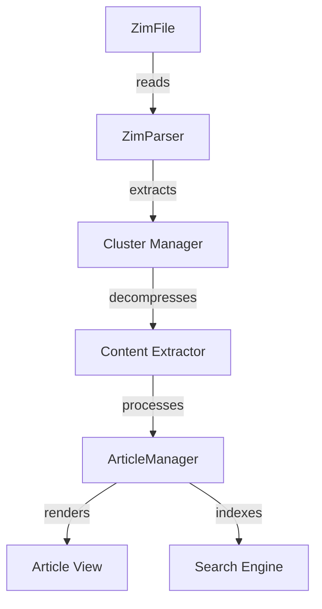
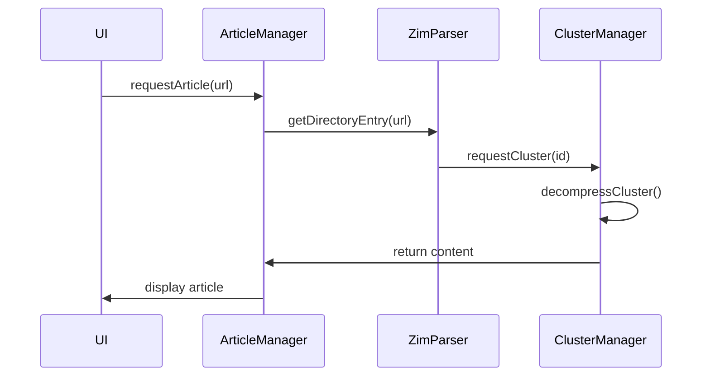
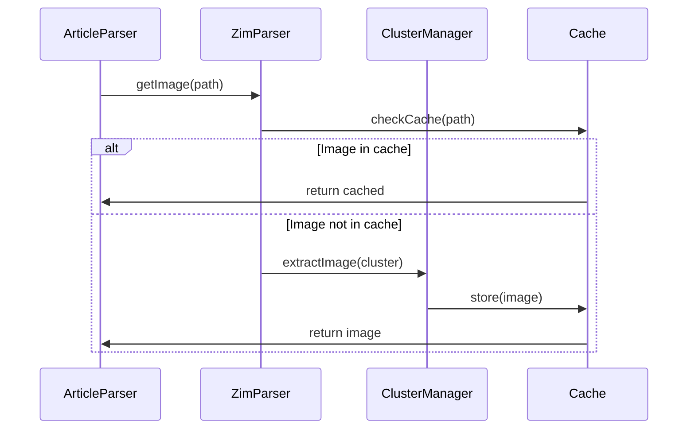

# ZIM Reader System Architecture

## Current Issues

1. Incomplete ZIM Implementation
   - Only header reading implemented
   - Missing directory entry parsing
   - No cluster decompression
   - No internal image handling

2. Article Parser Misalignment
   - Assumes web-like content structure
   - Downloads images from URLs (should read from ZIM)
   - No handling of ZIM-specific link formats
   - Inefficient image caching

3. Missing Core Features
   - No navigation between articles
   - No table of contents
   - No search functionality
   - No offline image support

## Proposed Architecture

### Component Responsibilities

1. ZimParser
   - Read ZIM file header
   - Parse directory entries
   - Manage file pointer
   - Map article URLs to clusters

2. Cluster Manager
   - Locate clusters
   - Handle compression
   - Cache management
   - Memory efficient reading

3. Content Extractor
   - Extract article content
   - Handle images
   - Process metadata
   - Manage references

4. ArticleManager
   - Content presentation
   - Navigation handling
   - State management
   - Cache coordination

## Implementation Plan

### Phase 1: Core ZIM Support (1 week)

1. ZimParser Enhancement
   - [ ] Complete directory entry parsing
   - [ ] Implement cluster access
   - [ ] Add memory-efficient reading
   - [ ] Create index structures

2. Content Extraction
   - [ ] Implement LZMA decompression
   - [ ] Handle different content types
   - [ ] Process internal images
   - [ ] Manage metadata

3. Article Presentation
   - [ ] Update ArticleParser for ZIM
   - [ ] Add link handling
   - [ ] Implement image display
   - [ ] Support offline access

### Phase 2: Navigation & Search (1 week)

1. Navigation System
   - [ ] Implement table of contents
   - [ ] Add breadcrumb navigation
   - [ ] Support history tracking
   - [ ] Handle cross-references

2. Search Functionality
   - [ ] Create search index
   - [ ] Implement full-text search
   - [ ] Add title search
   - [ ] Support partial matching

## Data Flow

1. Article Request Flow

2. Image Loading Flow

## Testing Strategy

1. Unit Tests
   - ZIM format parsing
   - Cluster decompression
   - Content extraction
   - Link processing

2. Integration Tests
   - End-to-end article loading
   - Image handling
   - Navigation paths
   - Search functionality

3. Performance Tests
   - Memory usage
   - Load times
   - Cache efficiency
   - Search speed

## Success Criteria

1. Basic Functionality
   - Articles load correctly
   - Images display properly
   - Links work as expected
   - Search finds content

2. Performance
   - Article load < 500ms
   - Memory usage < 100MB
   - Smooth scrolling
   - Responsive search

3. User Experience
   - Offline functionality
   - Clear navigation
   - Fast article switching
   - Reliable search

## Migration Steps

1. Update ZimParser
   - Implement remaining core functions
   - Add proper error handling
   - Include progress reporting

2. Modify ArticleParser
   - Remove external image handling
   - Add ZIM-specific processing
   - Integrate with ClusterManager

3. Create ClusterManager
   - Handle decompression
   - Manage caching
   - Optimize memory use

## Next Actions

1. Focus on completing ZimParser
2. Build ClusterManager
3. Update ArticleParser
4. Implement basic search
5. Add navigation system

Remember: Solid ZIM reading functionality must be in place before adding annotations or knowledge graph features.