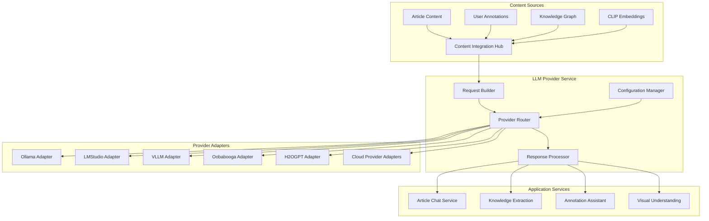
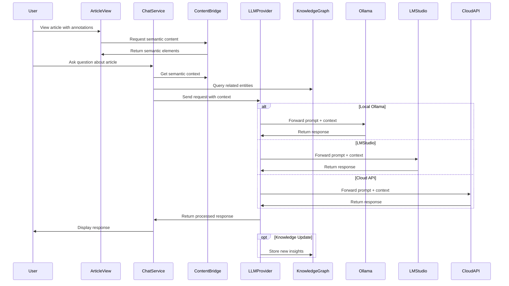
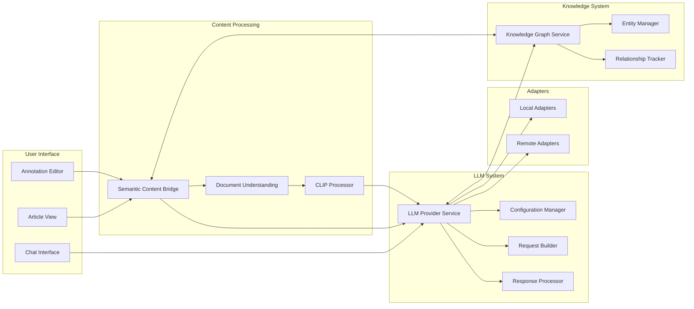
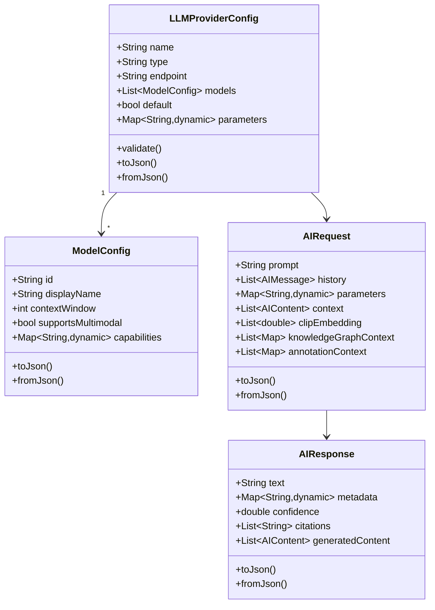
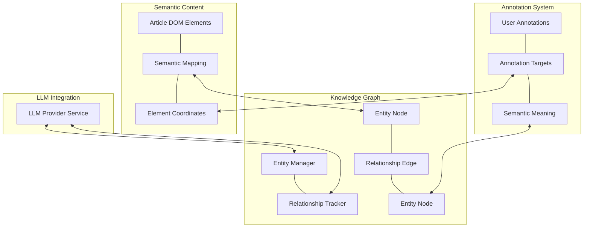
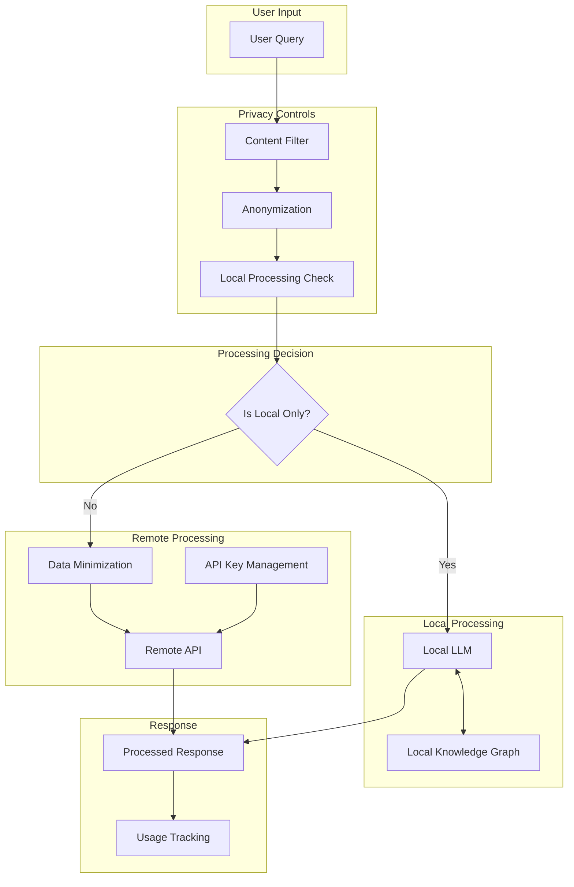

# LLM Provider Architecture Diagram

**Copyright (C)2025 Robin L. M. Cheung, MBA. All rights reserved.**

## High-Level Architecture

## Component Interaction Flow

## Data Flow Diagram

## Provider Configuration Model

## Integration with Knowledge Graph

## Security and Privacy Model

