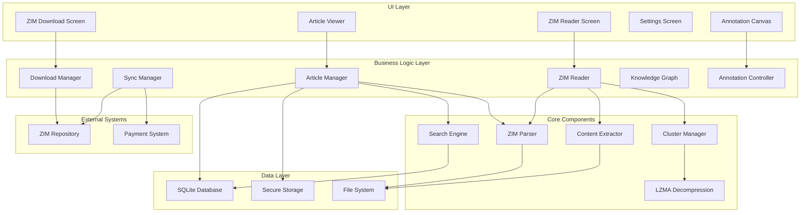
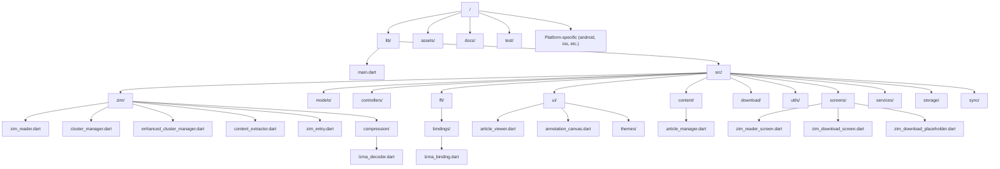
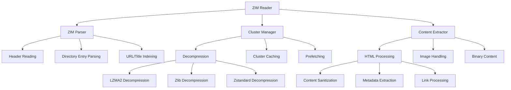
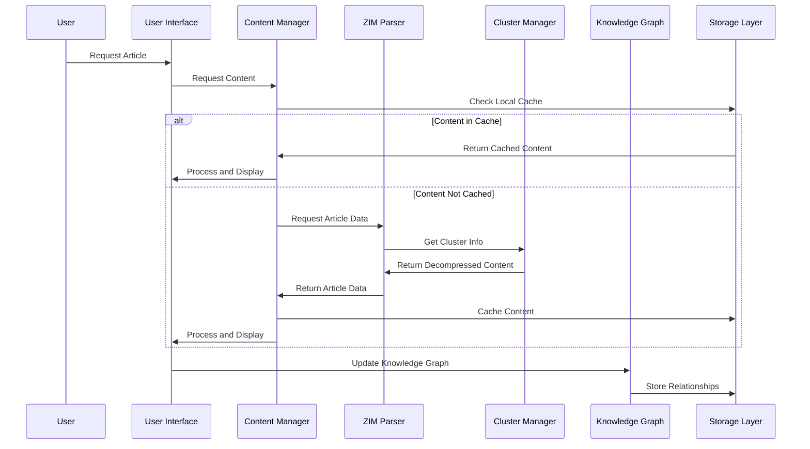
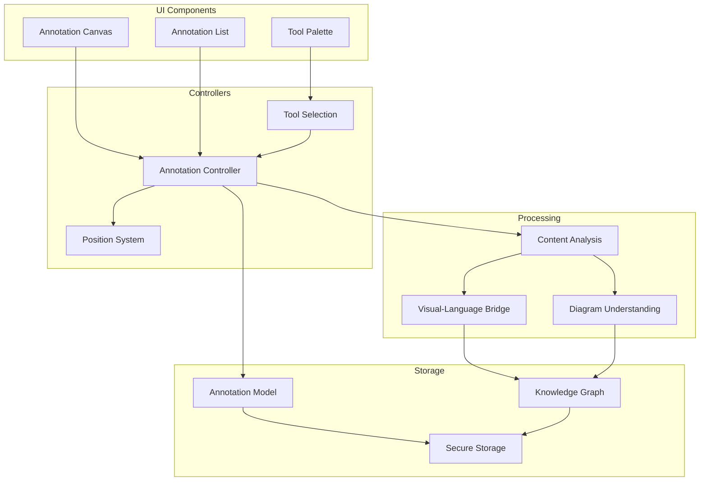
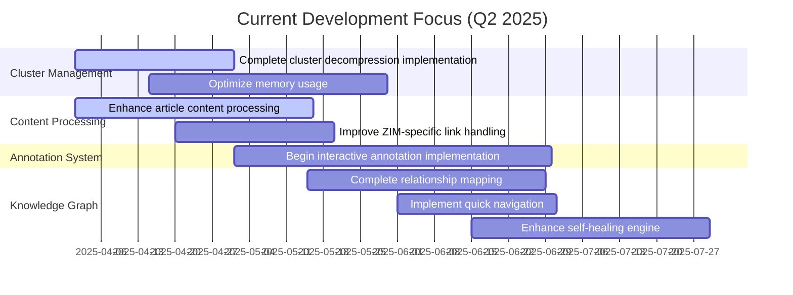
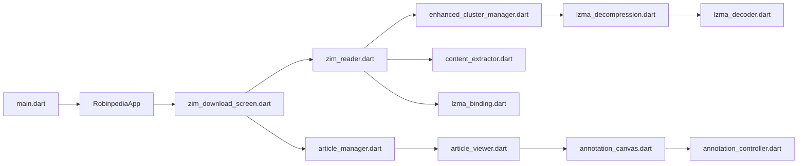

# Robinpedia Codebase Visualization

**Created:** April 16, 2025  
**Author:** Augment Agent  
**Purpose:** Visual representation of the Robinpedia codebase architecture

## 1. High-Level Architecture

## 2. Directory Structure

## 3. Core Components Detail

### 3.1 ZIM Parser System

### 3.2 Data Flow

### 3.3 Multimodal Annotation System (Galaxy Brain)

## 4. Implementation Status

| Component | Completion | Status | Notes |
|-----------|------------|--------|-------|
| **ZIM Parser** | 100% | ✅ | Header reading, MIME handling, directory entry parsing, URL/title indexing complete |
| **Download Manager** | 100% | ✅ | Includes resume capability, progress tracking, integrity verification |
| **Search Implementation** | 90% | ✅ | SQLite FTS5 indexing complete, link graph in progress |
| **Database Implementation** | 95% | ✅ | Schema defined, article storage, search indexing complete, offline queue partially implemented |
| **Cluster Management** | 65% | 🔄 | Basic structure implemented, optimization needed |
| **Content Processing** | 50% | 🔄 | ZIM-specific HTML processing in progress |
| **LZMA2 Decompression** | 75% | 🔄 | Basic implementation complete, performance optimization needed |
| **Knowledge Graph** | 40% | 🔄 | Foundation implemented, self-healing engine partially complete |
| **UI Components** | 60% | 🔄 | Core viewing components complete, advanced features in progress |
| **Interactive Annotation** | 0% | ⬜ | Planned with canvas-like capability for multimedia annotations |
| **Learning Path Generation** | 0% | ⬜ | Not started, dependent on knowledge graph completion |
| **Social Features** | 0% | ⬜ | Not started, planned for future phases |

**Legend**: ✅ Complete | 🔄 In Progress | ⬜ Not Started

## 5. Current Development Focus

## 6. Key Files and Their Relationships

## 7. Current Issues

1. **Dev Builds Show Placeholders**: The current implementation falls back to placeholder content instead of displaying actual ZIM content
   - Located in `lib/src/zim/zim_reader.dart` in the `getContentByUrl` method
   - Fallback occurs in the catch block with `_getSampleContent(url)`
   - Needs to be fixed by completing the cluster decompression implementation

2. **Incomplete ZIM Implementation**:
   - Only header reading fully implemented
   - Directory entry parsing partially implemented
   - Cluster decompression needs completion
   - Internal image handling missing

3. **Article Parser Misalignment**:
   - Assumes web-like content structure
   - Downloads images from URLs (should read from ZIM)
   - No handling of ZIM-specific link formats
   - Inefficient image caching

4. **Missing Core Features**:
   - No navigation between articles
   - No table of contents
   - No search functionality
   - No offline image support
