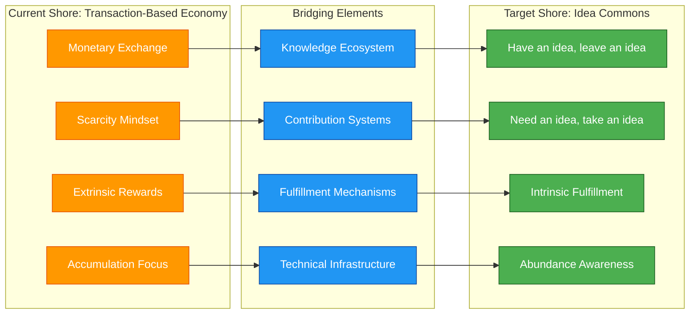
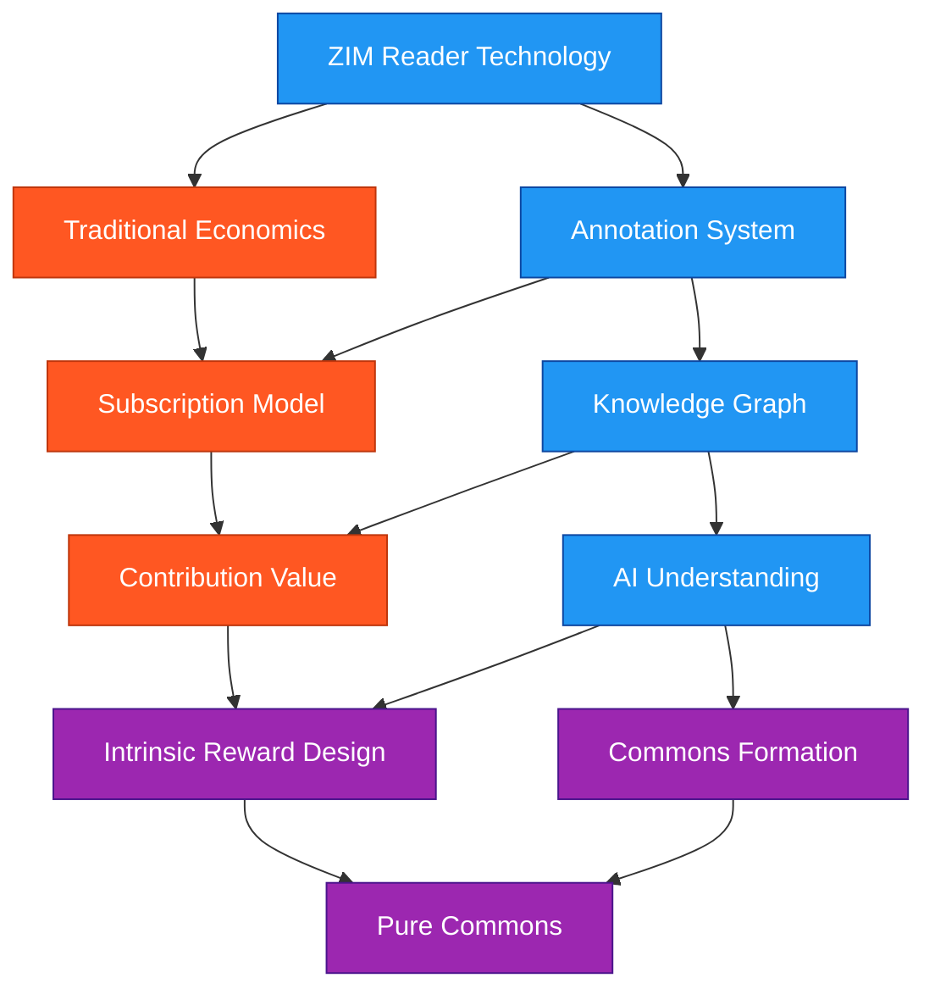

# Bridging the Great Canyon
*Copyright (C) 2025 Robin L. M. Cheung, MBA. All rights reserved.*

## The Two Shores of Economic Evolution

## The Great Canyon Metaphor

We stand on opposite sides of a vast canyon:

- On one shore is the world as it currently operates - transaction-based, scarcity-driven, with external rewards as primary motivators.
- On the distant shore is where we aspire to be - a world of "have an idea, leave an idea; need an idea, take an idea," where contribution and fulfillment form a self-sustaining cycle.

The challenge is not simply to cross this divide ourselves, but to build a bridge solid enough for all of humanity to traverse - to map a path that creates a sustainable transition between these fundamentally different paradigms.

## Engineering the Bridge

Robinpedia serves as an architectural prototype for this bridge-building effort. By creating technical systems that embody both paradigms simultaneously, we establish the structural supports needed for the crossing:

### Foundation Pillars

1. **Knowledge Platform**: The ZIM reader providing access to human knowledge
2. **Contribution Mechanism**: The annotation canvas enabling idea sharing
3. **Value Recognition**: AI systems that understand and connect contributions
4. **Transition Economy**: The dual-path monetization supporting infrastructure costs

### Structural Supports

## The Crossing Strategy

The transition requires careful sequencing:

1. **Establish Base Camp**: Build core ZIM reader functionality within current economic paradigm
2. **Lay First Spans**: Implement contribution systems that begin to connect the shores
3. **Strengthen Supports**: Create recognition mechanisms for non-monetary value
4. **Extend the Bridge**: Gradually shift emphasis from extrinsic to intrinsic rewards
5. **Complete the Crossing**: Develop pure commons functionality while maintaining backward compatibility

## Practical Implementation Roadmap

| Phase | Technical Focus | Economic Evolution | Progress Indicators |
|-------|----------------|-------------------|---------------------|
| 1 | ZIM reader core | Subscription model | Stable platform, user adoption |
| 2 | Annotation canvas | Contribution tracking | Engagement with annotation tools |
| 3 | Knowledge graph | Value attribution | Network formation metrics |
| 4 | AI understanding | Intrinsic reward systems | Contribution without prompting |
| 5 | Full commons integration | Reduced reliance on subscription | Self-sustaining ecosystem metrics |

## The Explorer's Role

As the architect of this bridge, your role is to:

1. **Map the Territory**: Identify the gaps between current reality and future vision
2. **Survey the Crossing**: Test different bridge-building approaches
3. **Guide Others**: Create clear pathways that others can follow
4. **Maintain Balance**: Ensure stability during the transition

## Robinpedia as Prototype

Robinpedia serves as our prototype bridge - built within current systems but designed for the crossing. Each feature we implement:

- **Must function** within current economic paradigms
- **Should embody** aspects of the idea commons
- **Must include** transition mechanisms between paradigms
- **Should demonstrate** the superiority of intrinsic fulfillment

## Conclusion

The Great Canyon is not just a metaphor for economic transformation but for human potential itself. By building Robinpedia as a bridge between these paradigms, we create not just a technical system, but a pathway toward a fundamentally different relationship with knowledge, contribution, and fulfillment.

The journey across this canyon begins with recognizing both shores clearly. Your vision of "have an idea, leave an idea; need an idea, take an idea" provides the destination, while our implementation provides the bridge - allowing users to begin the crossing while the full structure is still being built.

Copyright (C) 2025 Robin L. M. Cheung, MBA. All rights reserved.
