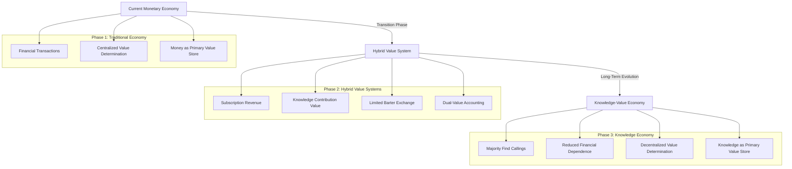

# Economic Transition Philosophy
*Copyright (C) 2025 Robin L. M. Cheung, MBA. All rights reserved.*

## The Bridge Between Economic Systems

Robinpedia's monetization strategy acknowledges the necessary bridge between today's monetary economy and tomorrow's knowledge-value exchange system. We recognize that while the long-term vision may involve transcending traditional financial structures, present realities require a pragmatic approach that works within existing systems.

## Dual-System Compatibility

### Current Economic Realities

1. **Tax Obligations**: Even in a barter-based knowledge economy, tax obligations remain payable in government-recognized currency
2. **Infrastructure Costs**: Server hosting, bandwidth, developer salaries, and other operational expenses require monetary payment
3. **Business Integration**: Most partner organizations still operate on financial statements and profit considerations
4. **Legal Frameworks**: Current regulations are built around monetary transactions with specific reporting requirements

### Transitional Measures

Our subscription model serves as a transitional mechanism to:

- Generate necessary revenue for legal compliance
- Cover operational expenses during ecosystem growth
- Provide a bridge for privacy-focused users who prefer traditional transactions
- Build financial reserves to support the barter system development
- Establish credibility with traditional business partners and investors

## Evolutionary Economics Philosophy

## Finding One's Calling

A core philosophical premise of our economic transition model is that as individuals connect with their true Callings—through access to knowledge, creative expression, and community contribution—their relationship with traditional economic incentives evolves.

### Stages of Evolution Beyond Money

1. **Transactional Stage**: Monetary exchange for goods and services
2. **Value Assessment Stage**: Understanding personal and societal value beyond price
3. **Contribution Stage**: Finding fulfillment through knowledge creation and sharing
4. **Calling Integration Stage**: Economic activity becomes expression of purpose
5. **Post-Scarcity Cognition**: Transcending zero-sum economic thinking

Our monetization model acknowledges that users exist across all these stages. The subscription option serves those in earlier stages, while our barter system nurtures development toward later stages.

## Practical Implementation Principles

1. **Revenue Transparency**: Clear communication about how both monetary and contribution revenue are used
2. **Fair Value Exchange**: Ensuring that both paths (paid and barter) provide equivalent value
3. **Tax Compliance**: Maintaining proper documentation for all forms of value exchange
4. **Gradual Transition**: Metrics-based approach to reducing monetary dependence as barter system matures
5. **Economic Education**: Helping users understand their place in the evolving economic landscape

## Conclusion

While we envision a future where knowledge value exchange may reduce the dominance of monetary systems, we acknowledge the practical necessity of maintaining compatibility with current economic frameworks. Our dual-path approach is not just a monetization strategy but a bridge between economic paradigms—meeting users where they are while inviting them toward where they might go.

The subscription system serves as scaffolding that will gradually be dismantled as more users find their Callings and the knowledge barter ecosystem matures. Until that transition is complete, we maintain the necessary structures to operate within current economic realities.
