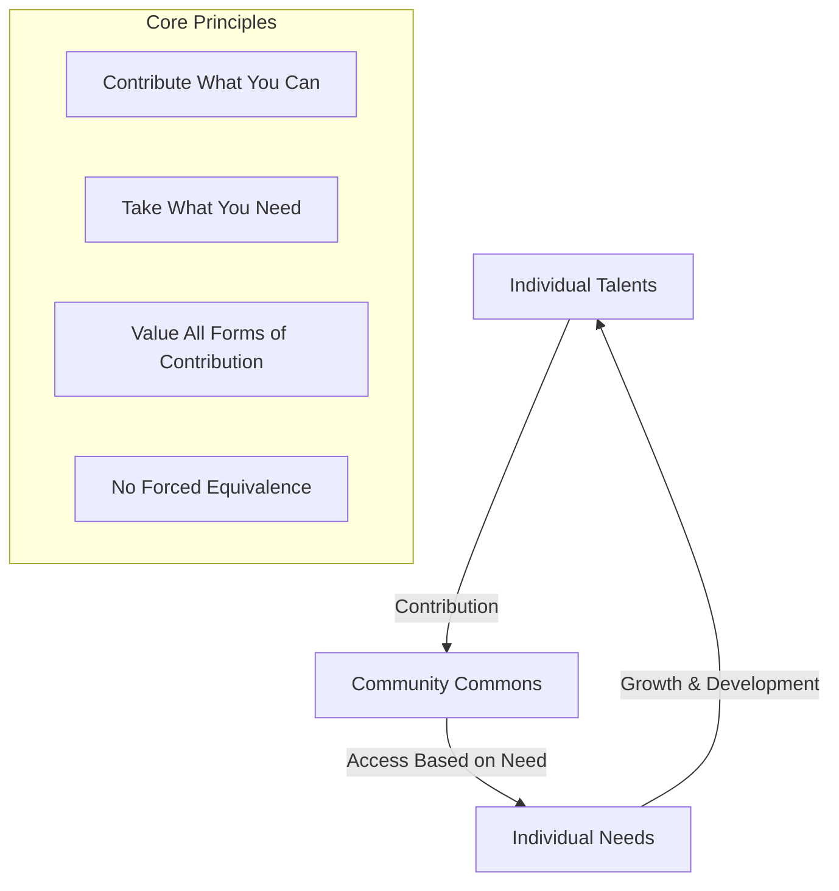
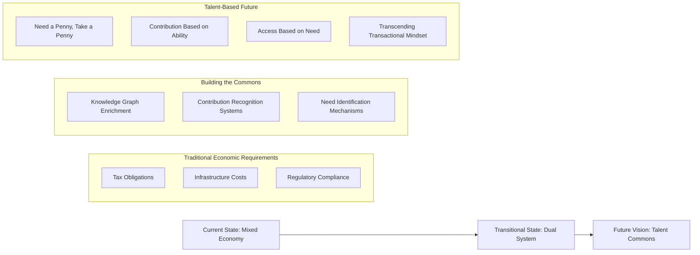

# The Talent Commons: Beyond Traditional Economics
*Copyright (C) 2025 Robin L. M. Cheung, MBA. All rights reserved.*

## "Need a Penny, Take a Penny; Have a Penny, Leave a Penny"

Robinpedia envisions an economic model inspired by the humble penny tray found at convenience store counters - a simple system where those who need take what they require, and those who have abundance contribute what they can. In our model, these "pennies" represent talents, knowledge, and contributions.

**The fundamental principle**: All reward is internally derived fulfillment, dramatically outweighing any material rewards—which would be freely available anyway. The intrinsic satisfaction of contribution, creation, and alignment with one's true calling becomes the primary motivator, transcending the need for external incentives.

## The Talent Commons Paradigm

### Fundamental Differences from Traditional Systems

| Traditional Economy | Barter Economy | Talent Commons |
|---------------------|----------------|----------------|
| Exchange based on fixed prices | Direct exchange of goods/services | Contribution without expectation of direct return |
| Value determined by market | Value determined by bilateral agreement | Value derived from community benefit |
| Scarcity-driven | Exchange-balance driven | Abundance-oriented |
| Accumulation as goal | Fair trade as goal | Internal fulfillment as goal |
| External rewards | Direct reciprocity | Intrinsic satisfaction |
| "What can I get for my money?" | "What can I trade this for?" | "How can my contribution fulfill my calling?" |

## Transitional Implementation

While we work toward this vision, we acknowledge the present need for compatibility with traditional economic structures. Our subscription model serves as a bridge, not an end state.

### The Knowledge Penny Tray

In our current implementation:

1. **Free Users**: Leave "pennies" in the form of:
   - Their browsing patterns that enrich the knowledge graph
   - Annotations that provide context and insights
   - Usage data that improves features for all

2. **Subscription Users**: Support the commons through:
   - Financial contributions that maintain infrastructure
   - Participation in the ecosystem's growth
   - Future transition to contribution-based participation as the system matures

## The Path to Talent-Based Economics

## Finding Your "Pennies" to Share

As users engage with Robinpedia's knowledge ecosystem, they discover their own unique talents or "pennies" to contribute:

1. **Knowledge Organization**: Connecting concepts across domains
2. **Content Curation**: Identifying valuable information
3. **Context Addition**: Providing explanatory annotations
4. **Pattern Recognition**: Discovering relationships between ideas
5. **Question Formulation**: Asking insightful questions that benefit others
6. **Knowledge Validation**: Verifying and improving information quality

The system evolves to recognize and facilitate these contributions, creating a self-reinforcing ecosystem where talents are shared freely without the constraints of direct exchange requirements.

### The Fulfillment Reward System

Contribution within this system generates profound internal rewards:

- **Mastery**: The satisfaction of developing and exercising expertise
- **Purpose**: Connection to something larger than oneself
- **Autonomy**: Self-directed engagement aligned with personal values
- **Flow States**: Deep immersion in meaningful activity
- **Legacy Creation**: Building something that outlasts individual contribution

These intrinsic rewards dramatically outweigh any material incentives, which become secondary and ultimately freely available as the system matures. The experience of contribution itself becomes the primary reward—a fundamentally different paradigm from transactional systems.

## Practical Development Roadmap

| Phase | Description | Current Status |
|-------|-------------|----------------|
| 1: Traditional Foundation | Subscription model and basic contribution tracking | In progress |
| 2: Contribution Recognition | Systems to identify, measure, and acknowledge various forms of contribution | Planning |
| 3: Need-Based Access | Mechanisms for accessing advanced features based on contribution capacity and need | Future |
| 4: Full Talent Commons | Complete transition to "need a penny, take a penny" model for all system aspects | Vision |

## Conclusion

While traditional economic structures remain necessary in the near term, our design philosophy and long-term vision align with the "need a penny, take a penny" approach where individuals contribute their talents freely and access what they need from the commons.

The subscription option is not our destination but merely a stepping stone—a recognition that we must build this new system from within the existing economic framework, gradually reshaping it toward a model where talents flow freely from each according to their abilities, to each according to their needs.

Ultimately, we envision a system where all reward is internally derived fulfillment that dramatically outweighs any material rewards—which would be freely available anyway. This represents a fundamental shift from extrinsic to intrinsic motivation, from scarcity to abundance, and from transaction to contribution. It's not just a new economic model, but a new way of being.

Copyright (C) 2025 Robin L. M. Cheung, MBA. All rights reserved.
