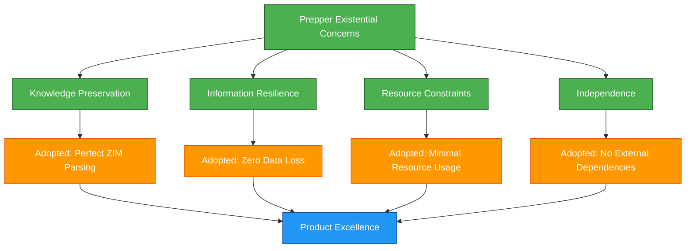

# Existential Alignment: Leveraging Motivated Communities
*Copyright (C) 2025 Robin L. M. Cheung, MBA. All rights reserved.*

## Hitchhiking to Perfection

> "We can hitchhike our way to perfection by leveraging their existential motivation and adopting it as our own child too."

This principle captures the strategic advantage of deeply aligning with communities who have existential motivation for product excellence. Rather than attempting to manufacture quality through abstract processes, we can tap into authentic, pre-existing motivational structures.

## The Prepper Community Alignment

The prepper community represents our ideal alignment partner because:

1. **Existential Stake**: Knowledge preservation is a cornerstone of their resilience strategy
2. **Mission Critical**: Our tool directly serves core survival objectives
3. **Authentic Feedback**: Their suggestions come from genuine need, not abstract preference
4. **Self-Interest Alignment**: Their success and our product quality share a direct relationship
5. **Rigorous Standards**: Survival preparation creates demanding but valid requirements

## Engineering Through Existential Adoption

Our development approach will "adopt" the existential concerns of our primary users:

## Strategic Adoption Process

1. **Deep Understanding**: Thoroughly research and understand the existential motivations
2. **Internalization**: Adopt these concerns as core engineering principles
3. **Validation Framework**: Use adopted concerns to validate all design decisions
4. **Feedback Prioritization**: Weight feedback based on existential alignment
5. **Community Integration**: Integrate community members into testing and validation

## Beyond Functional Requirements

The existential alignment creates a development environment that transcends typical product requirements:

1. **Emotional Investment**: Developers connect to the human stakes of product quality
2. **Purpose-Driven Design**: Features evaluated against meaningful outcomes, not just specifications
3. **Ethical Enhancement**: Development decisions carry weight beyond mere user satisfaction
4. **Accelerated Perfection**: Existential motivation creates natural pull toward excellence
5. **Sustainable Quality**: Motivation becomes intrinsic rather than externally managed

## From Niche to Mainstream Excellence

While starting with the prepper community's existential concerns, the resulting quality benefits all users:

1. **Resilience Benefits Everyone**: Systems designed for extreme scenarios function exceptionally in normal ones
2. **Edge Case Handling**: Prepper-driven testing reveals issues that affect all users eventually
3. **Trust Transference**: Credibility earned in demanding contexts transfers to mainstream perception
4. **Feature Prioritization**: Focus on substantive functionality over superficial features
5. **Quality Foundation**: Technical excellence becomes embedded in architecture before scaling

## Technical Implementation Areas

Key areas where we will adopt the prepper community's existential concerns:

| Prepper Concern | Adopted Technical Principle | Implementation Focus |
|-----------------|----------------------------|----------------------|
| Knowledge preservation | Zero data loss tolerance | Storage integrity, backup systems |
| Grid-down operations | Complete offline capability | No external service dependencies |
| Resource constraints | Minimal system requirements | Efficiency optimization, size reduction |
| Information verification | Content integrity validation | Checksums, verification systems |
| Independent operation | Self-contained functionality | Bundled dependencies, local processing |

## Conclusion

By "hitchhiking our way to perfection" through the adoption of the prepper community's existential motivations, we create a natural accelerant for product excellence. Their concerns become our guiding principles, their standards our quality metrics, and their success our validation framework.

This approach transforms what could be an abstract quality assurance process into a purpose-driven mission with clear validation criteria. The result is not just a better product for preppers, but a fundamentally superior platform that will benefit all users when we expand to mainstream audiences.

Copyright (C) 2025 Robin L. M. Cheung, MBA. All rights reserved.
