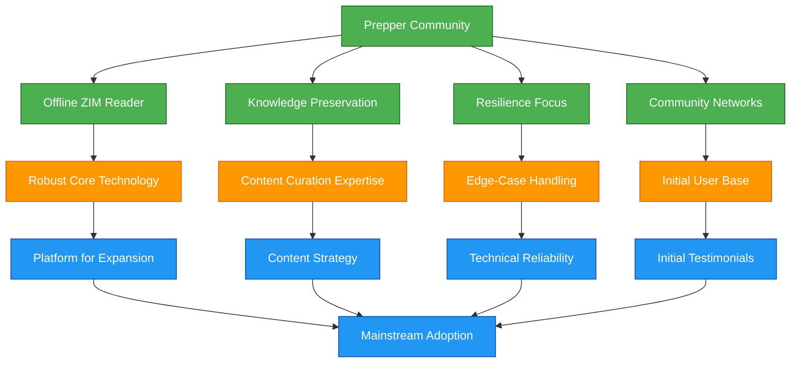
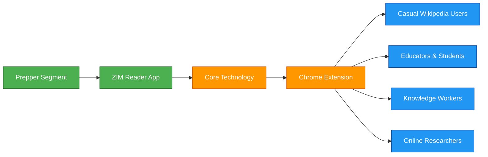
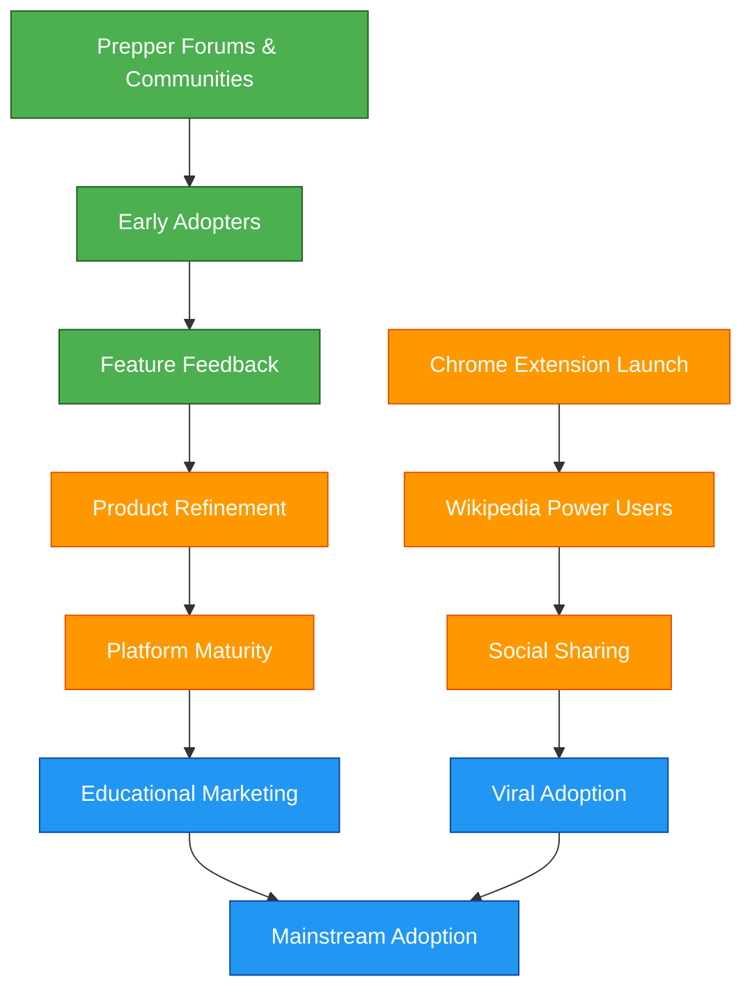

# Robinpedia Market Adoption Strategy

*Copyright (C) 2025 Robin L. M. Cheung, MBA. All rights reserved.*

## Strategic Market Focus: From Niche to Mainstream

Robinpedia's market adoption strategy follows a deliberate path from a well-defined, highly engaged niche to broader mainstream adoption. This document outlines our approach to market penetration, community building, and platform expansion.

## Prepper Community: Our Strategic Beachhead

### Why Preppers Are an Ideal Initial Market

1. **Clearly Defined Need**: The prepper community has a specific, urgent desire for offline knowledge solutions
2. **Community Coherence**: Well-connected networks with shared values and communication channels
3. **Technical Appreciation**: Understands and values robust, resilient technology
4. **Aligned with Core Value**: Directly benefits from our offline-first ZIM reader implementation
5. **Evangelists Potential**: Likely to share valuable solutions within their communities
6. **Constructive Feedback Loop**: Motivated to provide high-quality suggestions due to aligned self-interest

### The Prepper Feedback Advantage

The prepper community offers a unique advantage in product development feedback loops:

1. **Value-Aligned Input**: Their suggestions stem from authentic use cases rather than abstract preferences
2. **Constructive Approach**: More likely to offer actionable improvements rather than mere complaints
3. **Investment in Success**: Their reliance on the tool creates genuine investment in its improvement
4. **Technical Pragmatism**: Focus on functional solutions rather than superficial features
5. **Testing Rigor**: Likely to test extensively in challenging scenarios (offline, resource-constrained)

This feedback quality creates a virtuous development cycle where:

- User needs directly inform feature prioritization
- Edge cases are identified early through real-world testing
- Product robustness improves through practical challenge scenarios
- Development resources focus on substantive improvements

The quality of this feedback loop dramatically exceeds what would be available from casual users or more general market segments, creating a solid foundation for product maturity before mainstream expansion.

### Core Features for Prepper Segment

1. **Offline Capability**: Complete functionality without internet connectivity
2. **Knowledge Preservation**: Durable storage of critical information
3. **Resource Efficiency**: Low power usage and minimal system requirements
4. **Import/Export**: Data portability and backup options
5. **Resilience**: Robust error handling and recovery mechanisms

## Bridging to Mainstream: The Chrome Extension

### The Extension as Market Bridge

The Chrome extension serves as our bridge to mainstream adoption by:

1. **Eliminating Friction**: No separate application download required
2. **Enhancing Existing Behavior**: Adds value to current Wikipedia browsing
3. **Progressive Engagement**: Introduces users to annotation capabilities without requiring full commitment
4. **Network Effects**: Enables social sharing of annotations, driving viral adoption
5. **Education Pathway**: Creates awareness of the full ZIM reader capabilities

### Technical Continuity

Our dual deployment strategy maintains technical continuity through:

1. Shared annotation engine
2. Compatible data formats
3. Synchronization capabilities
4. Consistent UI/UX principles
5. Unified knowledge graph integration

## Market Expansion Timeline

| Phase | Primary Focus | Secondary Development | Timeline |
|-------|--------------|----------------------|----------|
| 1: Core Foundation | ZIM Reader for Preppers | Technical Architecture | Q2-Q3 2025 |
| 2: Bridge Building | Chrome Extension Alpha | ZIM Reader Enhancement | Q3-Q4 2025 |
| 3: Dual Launch | Extension Public Release | ZIM Reader Stable Release | Q4 2025 |
| 4: Cross-Pollination | Sync Capabilities | Community Features | Q1 2026 |
| 5: Mainstream Growth | Extension Marketing | Education Market Entry | Q2 2026 |

## Community Building Strategy

### Prepper Community Engagement

1. **Forum Participation**: Active engagement in prepper and self-reliance communities
2. **Content Partnerships**: Collaborations with trusted prepper content creators
3. **Feature Prioritization**: Development roadmap heavily influenced by community feedback
4. **Case Studies**: Highlighting prepper success stories and use cases
5. **Community Recognition**: Acknowledging contributions from early adopters
6. **Feedback Systems**: Structured channels for collecting and implementing constructive suggestions
7. **Collaborative Testing**: Engaging community members in scenario-based testing challenges
8. **Transparency**: Open communication about development priorities and technical constraints

### Mainstream Transition

1. **Chrome Store Marketing**: Targeted campaigns for extension discovery
2. **Wikipedia Community Engagement**: Outreach to Wikipedia editors and power users
3. **Education Sector Promotion**: Positioning as a learning and research tool
4. **Knowledge Worker Focus**: Productivity and insight management messaging
5. **Integration Partnerships**: Connecting with complementary tools and platforms

## Measuring Success

### Prepper Segment Metrics

1. **Community Sentiment**: Forum feedback and sentiment analysis
2. **ZIM Reader Adoption**: Downloads and active installations
3. **Feature Utilization**: Usage patterns of core offline capabilities
4. **Offline Content Management**: ZIM file collection behaviors
5. **Community Contribution**: Bug reports, feature requests, and testimonials

### Mainstream Adoption Metrics

1. **Extension Installs**: Chrome Web Store performance
2. **Daily Active Users**: Regular engagement with the extension
3. **Annotation Creation**: Volume and quality of created annotations
4. **Knowledge Graph Contribution**: Opt-in rates for data sharing
5. **Cross-Platform Adoption**: Migration from extension to full ZIM reader

## Long-Term Vision

While maintaining our commitment to the prepper community's needs, our long-term vision involves:

1. **Education Platform**: Becoming a standard tool for research and learning
2. **Knowledge Management Ecosystem**: Expanding beyond Wikipedia to other knowledge sources
3. **Cross-Platform Presence**: Native applications across all major platforms
4. **Self-Sustaining Commons**: Achieving the "need an idea, take an idea" philosophical vision
5. **Global Knowledge Access**: Supporting offline knowledge in connectivity-challenged regions

## Conclusion

The prepper community represents not just our initial market, but a core constituency whose needs align perfectly with our technical capabilities and philosophical values. By starting with this well-defined segment, we build a solid foundation for mainstream adoption through our Chrome extension bridge while maintaining our commitment to resilience, knowledge preservation, and the commons-based vision that drives Robinpedia.

Our dual deployment strategy honors the prepper roots while creating a pathway to bring these values to the broader world of online knowledge seekers.

Copyright (C) 2025 Robin L. M. Cheung, MBA. All rights reserved.
