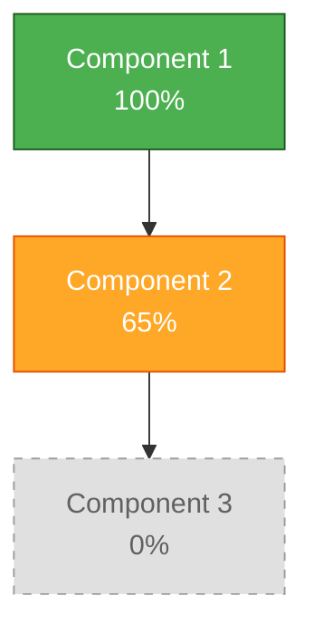
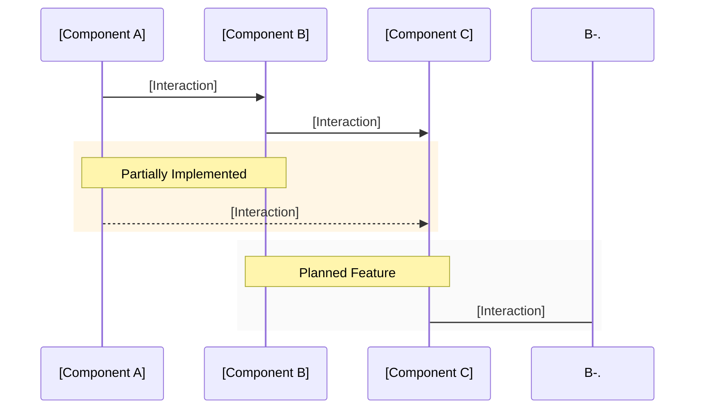

# Project Status Report

**Project Name**: [Project Name]  
**Last Updated**: [YYYY-MM-DD]  
**Version**: [X.Y.Z]  
**Author**: Robin L. M. Cheung, MBA  

## Snapshot Overview

| Metric | Status |
|--------|--------|
| Overall Completion | [XX]% |
| Build Status | ✅ Passing / 🔄 In Progress / ❌ Failing |
| Test Coverage | [XX]% |
| Documentation | ✅ Current / 🔄 Needs Update / ❌ Missing |
| Architecture | ✅ Stable / 🔄 Evolving / ❌ Needs Refactor |

## Component Status

## Implementation Details

| Component | Completion | Status | Notes |
|-----------|------------|--------|-------|
| **[Component 1]** | 100% | ✅ | [Brief description of status] |
| **[Component 2]** | 65% | 🔄 | [Brief description of status] |
| **[Component 3]** | 0% | ⬜ | [Brief description of status] |

**Legend**: ✅ Complete | 🔄 In Progress | ⬜ Not Started

## Data Flow

## Implementation Priority

### Current Focus ([Current Quarter])
1. [Priority 1]
2. [Priority 2]
3. [Priority 3]
4. [Priority 4]

### Near-Term Roadmap ([Next Quarter])
1. [Priority 1]
2. [Priority 2]
3. [Priority 3]
4. [Priority 4]

## Technical Specifications

### Core Technologies
- **Language/Framework**: [Technologies]
- **Storage**: [Technologies]
- **Architecture Pattern**: [Pattern]

### Key Dependencies
- **[Dependency 1]**: [Purpose]
- **[Dependency 2]**: [Purpose]
- **[Dependency 3]**: [Purpose]

## Buildability Status

| Platform | Status | Notes |
|----------|--------|-------|
| **[Platform 1]** | ✅/🔄/❌ | [Notes] |
| **[Platform 2]** | ✅/🔄/❌ | [Notes] |
| **[Platform 3]** | ✅/🔄/❌ | [Notes] |

## Testing Coverage

- **Unit Tests**: [XX]% coverage of core components
- **Integration Tests**: [Status]
- **Performance Tests**: [Status]

## Critical Risks

| Risk | Severity | Mitigation Strategy |
|------|----------|---------------------|
| **[Risk 1]** | High/Medium/Low | [Strategy] |
| **[Risk 2]** | High/Medium/Low | [Strategy] |
| **[Risk 3]** | High/Medium/Low | [Strategy] |

## Next Major Features

### [Feature 1]

[Brief description of the feature]

- [Key capability 1]
- [Key capability 2]
- [Key capability 3]

### [Feature 2]

[Brief description of the feature]

- [Key capability 1]
- [Key capability 2]
- [Key capability 3]

## Cross-Project Dependencies

| Project | Dependency | Status |
|---------|------------|--------|
| **[Project 1]** | [Dependency] | ✅/🔄/❌ |
| **[Project 2]** | [Dependency] | ✅/🔄/❌ |

## Documentation Trackers

| Document | Last Updated | Status |
|----------|--------------|--------|
| **README.md** | [YYYY-MM-DD] | ✅/🔄/❌ |
| **ARCHITECTURE.md** | [YYYY-MM-DD] | ✅/🔄/❌ |
| **ROADMAP.md** | [YYYY-MM-DD] | ✅/🔄/❌ |
| **API.md** | [YYYY-MM-DD] | ✅/🔄/❌ |

## Compliance & Standards

| Standard | Status | Notes |
|----------|--------|-------|
| **[Standard 1]** | ✅/🔄/❌ | [Notes] |
| **[Standard 2]** | ✅/🔄/❌ | [Notes] |

## Review History

| Date | Reviewer | Summary |
|------|----------|---------|
| [YYYY-MM-DD] | [Name] | [Brief summary of review] |

## Copyright

Copyright (C) 2025 Robin L. M. Cheung, MBA. All rights reserved.
